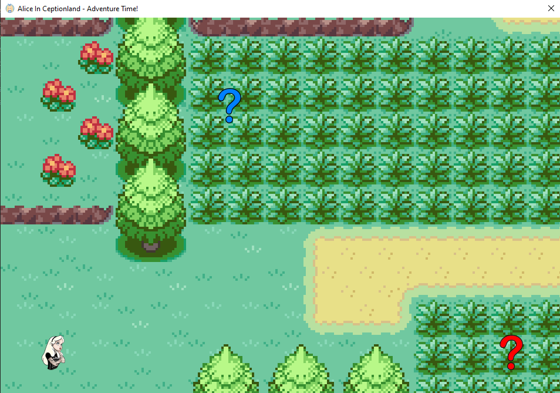

# corCTF 2021, AliceInCeptionland, rev

## Description
Our dear beloved Alice is undergoing a cerebral attack by some of the fiercest enemies known to man. Quick, get in there and help her!

## Solution
It is C# binary which is a simple game.

Using [dotPeek](https://www.jetbrains.com/decompiler/) decompiler we decompile the binary and see ([decompiled](./AliceInCeptionland)) that this challenge has three levels. The binary is using embedded binary to check last password. In the end it is simple challenge. All the leves are bruteforceable, so...

Password for first level is: `\xDE\xAD\xBE\xEF`
Second: `\x4\xL\x1\xC\x3\x1\xS\xN\x0\xT\x4\xS\xL\x3\x3\xP\xS\x4\xV\x3\xH\x3\xR`
Third: `Sleeperio Sleeperio Disappeario Instanterio!`

Flag: corctf{4l1c3_15_1n_d33p_tr0ubl3_b3c4us3_1_d1d_n0t_s4v3_h3r!!:c}

Solver for third level: [dec3.cs](./dec/Dream.cs)
