# European Cyber Security Challenge Eliminations 2021, Heroes 3 Challenge, pwn

## Description
Heroes 3 task.

## Solution
This one is a funny task. We have a given attachment [h3demo.zip](http://heroes3chall.ecsc21.hack.cert.pl/static/h3demo.zip?_v=3). It is a demo version of Heroes 3 game. Let's open the webpage with the challenge.

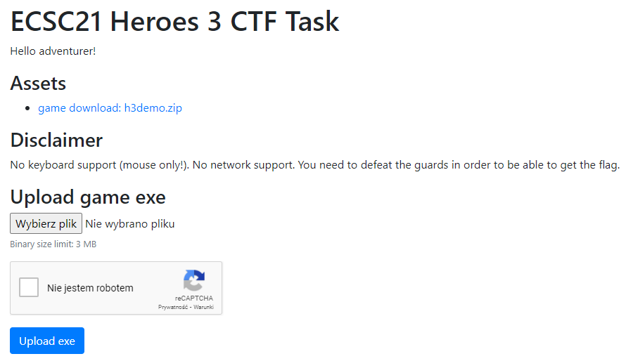

We have to "defeat the guards in order to be able to get the flag". Let's upload game exe (h3demo.exe). After a while VM is working and we can run the game

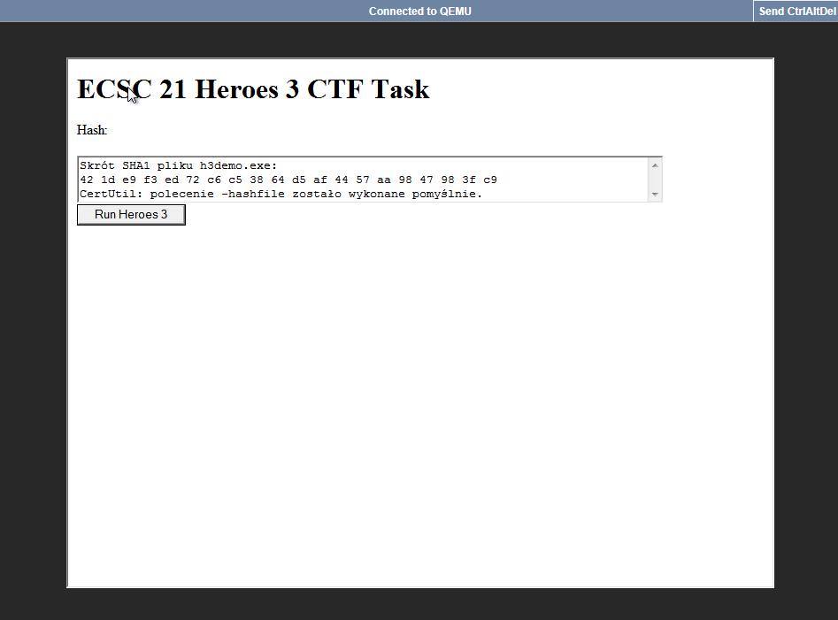

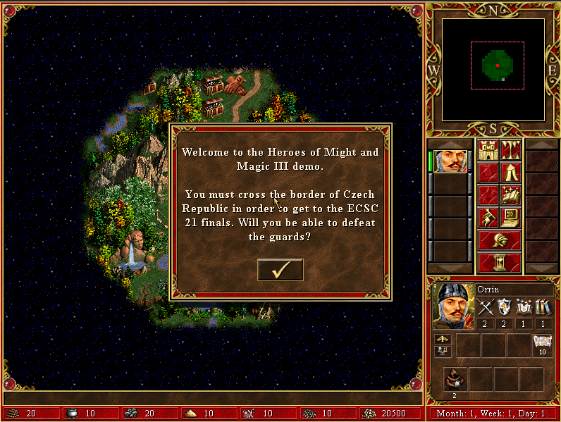

I tried picking up various things (artifacts, resources) but it is not useful.
We need to defeat garrison in order to move to the next location. But we have no army...

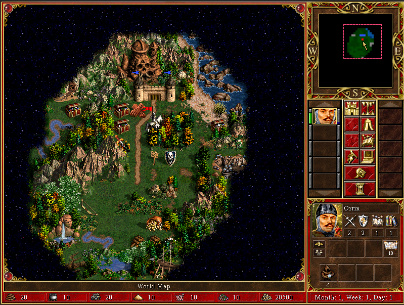

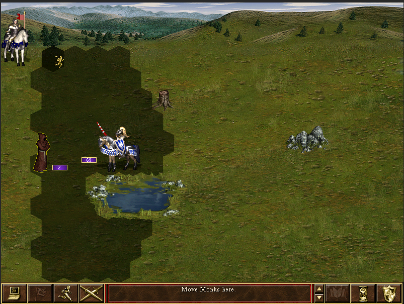

We have game binary, so we can modify a lot of things. I chose to modify the statistics of creatures because I did some heroes 3 modding in the past ;)
The stats are read from file called CRTRAITS.TXT. Sadly, I don't remember structure of this file so I had to unpack H3BITMAP.LOD to get it. I used tool called [MMarchive](https://grayface.github.io/wog/#MMArchive)

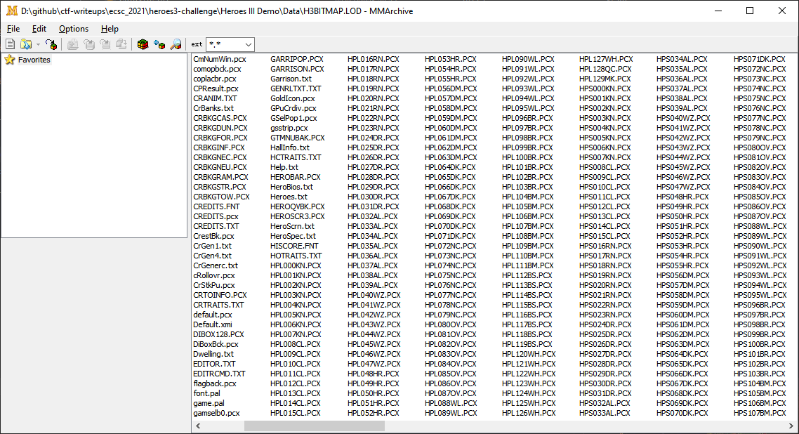

Unpacked file is here [CRTRAITS.TXT](./CRTRAITS.TXT). It is simple row-based text file which describes unit statistics, cost and other values. I fixed spacing between columns to the data could be more readable. As we saw earlier we have only two Monks and the opponent has 69 Champions, so lets modify HP and Speed of Champion to 1 and increase Monk's attack to some high value. We cannot do it in this file because challenge needs an exe, so we have to modify the values when game parses the configuration file. Let's open .exe in IDA and search for "CRTRAITS.TXT" string and look for usages

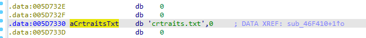

The function which uses "CRTRAITS.TXT" is in [parse_crtraits](./parse_crtraits.c) file.

This looks like opening file: `v0 = sub_50A1A0(aCrtraitsTxt);` and the rest of code looks like parsing sections from txt file (there is 10 occurences of calling `sub_46F570` function and txt file has exactly 10 sections). Let's look deeper into `sub_46F570` funcion.

```c
  strcpy(v6, *(const char **)(*(_DWORD *)(a2 + 4) + 4));
  *((_DWORD *)v3 + 6) = dword_5F9DC8[a1];
  *((_WORD *)v3 + 16) = atoi(*(const char **)(*(_DWORD *)(a2 + 4) + 8));
  *((_WORD *)v3 + 17) = atoi(*(const char **)(*(_DWORD *)(a2 + 4) + 12));
  *((_WORD *)v3 + 18) = atoi(*(const char **)(*(_DWORD *)(a2 + 4) + 16));
  *((_WORD *)v3 + 19) = atoi(*(const char **)(*(_DWORD *)(a2 + 4) + 20));
  *((_WORD *)v3 + 20) = atoi(*(const char **)(*(_DWORD *)(a2 + 4) + 24));
  *((_WORD *)v3 + 21) = atoi(*(const char **)(*(_DWORD *)(a2 + 4) + 28));
  *((_WORD *)v3 + 22) = atoi(*(const char **)(*(_DWORD *)(a2 + 4) + 32));
  *((_WORD *)v3 + 23) = atoi(*(const char **)(*(_DWORD *)(a2 + 4) + 36));
  *((_WORD *)v3 + 24) = atoi(*(const char **)(*(_DWORD *)(a2 + 4) + 40));
  *((_DWORD *)v3 + 13) = atoi(*(const char **)(*(_DWORD *)(a2 + 4) + 44));
  *((_WORD *)v3 + 28) = atoi(*(const char **)(*(_DWORD *)(a2 + 4) + 48));
  *((_DWORD *)v3 + 15) = atoi(*(const char **)(*(_DWORD *)(a2 + 4) + 52));
  *((_DWORD *)v3 + 16) = atoi(*(const char **)(*(_DWORD *)(a2 + 4) + 56));
  *((_DWORD *)v3 + 17) = atoi(*(const char **)(*(_DWORD *)(a2 + 4) + 60));
  *((_DWORD *)v3 + 18) = atoi(*(const char **)(*(_DWORD *)(a2 + 4) + 64));
  *((_DWORD *)v3 + 19) = atoi(*(const char **)(*(_DWORD *)(a2 + 4) + 68));
  *((_DWORD *)v3 + 20) = atoi(*(const char **)(*(_DWORD *)(a2 + 4) + 72));
  *((_DWORD *)v3 + 21) = atoi(*(const char **)(*(_DWORD *)(a2 + 4) + 76));
  *((_DWORD *)v3 + 22) = atoi(*(const char **)(*(_DWORD *)(a2 + 4) + 80));
  *((_DWORD *)v3 + 23) = atoi(*(const char **)(*(_DWORD *)(a2 + 4) + 84));
```

This looks like parsing a single row to the some kind of structure. Using a debugger I found that these three lines are responsible for loading hp, speed and attack respectively.

```c
  *((_DWORD *)v3 + 15) = atoi(*(const char **)(*(_DWORD *)(a2 + 4) + 52));
  *((_DWORD *)v3 + 16) = atoi(*(const char **)(*(_DWORD *)(a2 + 4) + 56));
  *((_DWORD *)v3 + 17) = atoi(*(const char **)(*(_DWORD *)(a2 + 4) + 60));
```

All we need now is to set hp to 1, speed to 1 and attack to 256. We don't care about rest of stats. Making patch in this place will cause overwriting the values for every unit, but we don't care about this. Using the [Keypatch](https://github.com/keystone-engine/keypatch) I patched the code and now it looks like this:

```c
  *((_DWORD *)v3 + 15) = 1;                     // hp
  *((_DWORD *)v3 + 16) = 1;                     // speed
  *((_DWORD *)v3 + 17) = 256;                   // attack
```
Now it's time for testing. Save patched binary and upload it to the challenge webpage. After a while we enter the fight and check the statistics of the units:

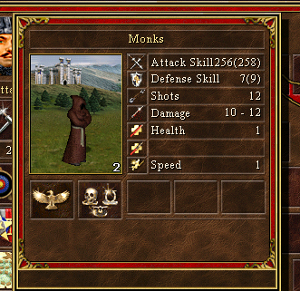

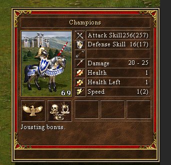


We won the fight using only two Monk's shots and we can proceed to the next area.

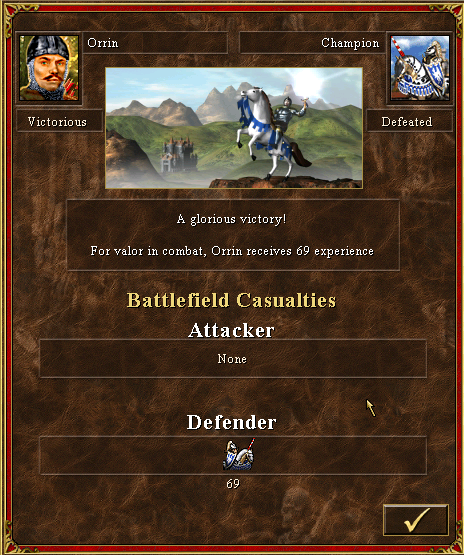

After going through the portal we were teleported to the closed area. The flag was written on the "floor" using lava pools :D

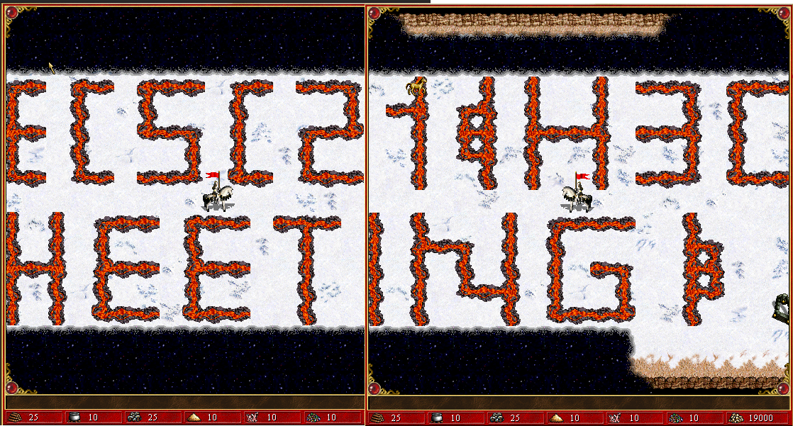

Flag: ecsc21{H3CHEETING}

Original binary: [h3demo.exe](./bin/h3demo.exe)

Patched binary: [h3demo_patched.exe](./bin/h3demo_patched.exe)
