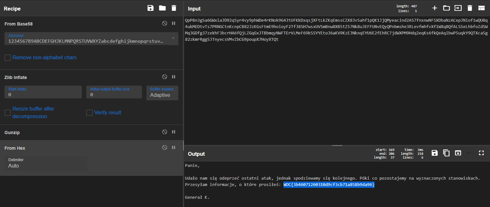

# Różdżka chaosu, List z frontu, misc

## Opis
"Ciekawe, co słychać w Hali Zgromadzeń?"

## Rozwiązanie

Udajemy się do Hali Zgromadzeń i dostajemy bliżej nieokreślony ciąg znaków. Wrzucamy go do [CyberChefa](https://gchq.github.io/CyberChef/) i wybieramy tryb From Base58, a potem Zlib Inflate, gunzip oraz from hex. Można to też zrobić za pomocą trybu "Magic".

