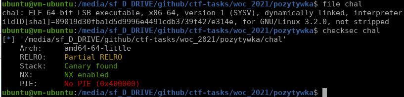

# Różdżka chaosu, Pozytywka, binary

## Opis
"W Galerii Machin można znaleźć wiele niesamowitych eksponatów."

## Rozwiązanie

Udajemy się do Galerii Machin i odnajdujemy link: `telnet://kctf.rozdzka.securing.pl:30003`

Na początku mały recon:

dekompilujemy binarkę za pomocą IDA [chal.c](./chal.c) i widzimy, że musimy wywołać funkcję `secret`. Po krótkiej analizie widzimy, że program dwukrotnie pobiera od nas dane za pomocą funkcji `gets`. Nie możemy bezpośrednio nadpisać return addresu, ponieważ program używa stack cookies. Zamiast tego możemy leaknąć stack cookie, ponieważ program wypisuje tablicę `dest`, która jest bezpośrednio przy stack cookie, a `strncpy` nie dodaje null byte na koniec stringa, więc printf wypisze wszystko aż do null byte.

Czyli - za pomocą pierwszego `gets` oraz `printf` leakujemy stack cookie, a za pomocą drugiego `gets` nadpiszemy return address (oraz stack cookie, ale tą samą wartością, czyli de facto cookie nie zmieni się).

Skrypt rozwiązujący: [solve.py](./solve.py)
