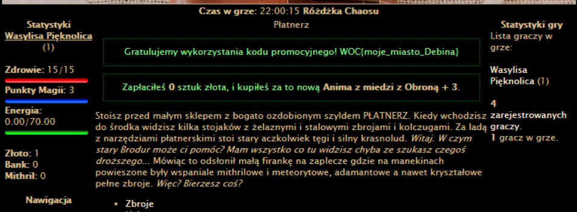

# Różdżka chaosu, Promocja, web

## Opis
"Niedawno z okazji Dni Dębiny miejscowy płatnerz oferował bardzo korzystną promocję. Czy uda Ci się z niej jeszcze skorzystać?"

## Rozwiązanie

Za pomocą mechanizmu podglądania źródła strony sprawdzamy plik `armor.php`.
Interesujący nas fragment znajduje się w pliku [armor.php](./armor.php).
Widzimy, że jest dostępny kod `DNIDEBINY2021`, ale niestety jest wygasły co uniemożliwia skorzystanie z niego.

Naszym celem jest wejście do drugiego bloku warunkowego w następującym fragmencie kodu

```php
if(strlen($_GET['promo']) > 0 && $today !== $promos[$_GET['promo']]['day']) {
   message('error', PROMO_EXPIRED);
} 
elseif($_GET['buy'] == $promos[$_REQUEST['promo']]['armId']) {
   message('success', PROMO_VALID); 
   $validPromo = True; 
   $arm -> fields['cost'] = 0;
} else {
   message('error', PROMO_INVALID);
}
```

aby to zrobić musimy ustawić parametr GET `promo` tak, aby miał on długość równą zero (wtedy pierwszy warunek nie zostanie spełniony i nie otrzymamy wiadomości, że promocja wygasła). Następnie w jakiś sposób musimy sprawić, aby drugi warunek został spełniony. Widzimy wykorzystanie zmiennej globalnek `$_REQUEST` - to jest wektor ataku. Jak można poczytać w [dokumentacji PHP](https://www.php.net/manual/en/reserved.variables.request.php) zmienna ta, przechowuje zawartość zmiennych: $_GET, $_POST oraz $_COOKIE. W takim razie spróbujmy przesłać kod promocyjny w ciasteczku, jednocześnie ustawiając parametr GET `promo` na pusty. Request, który został wysłany znajduje się w pliku [request.txt](./request.txt)

Po wykonaniu requesta otrzymujemy flagę:


