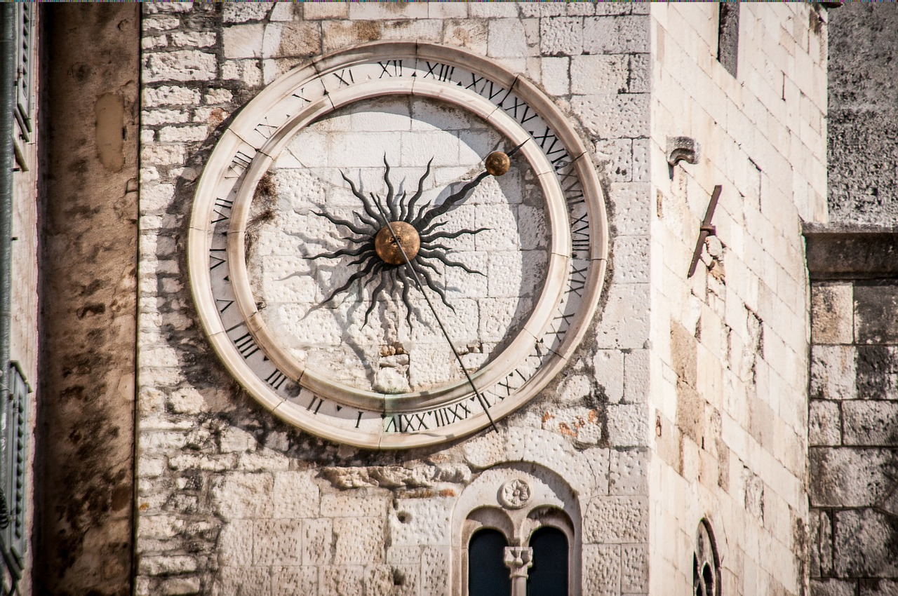
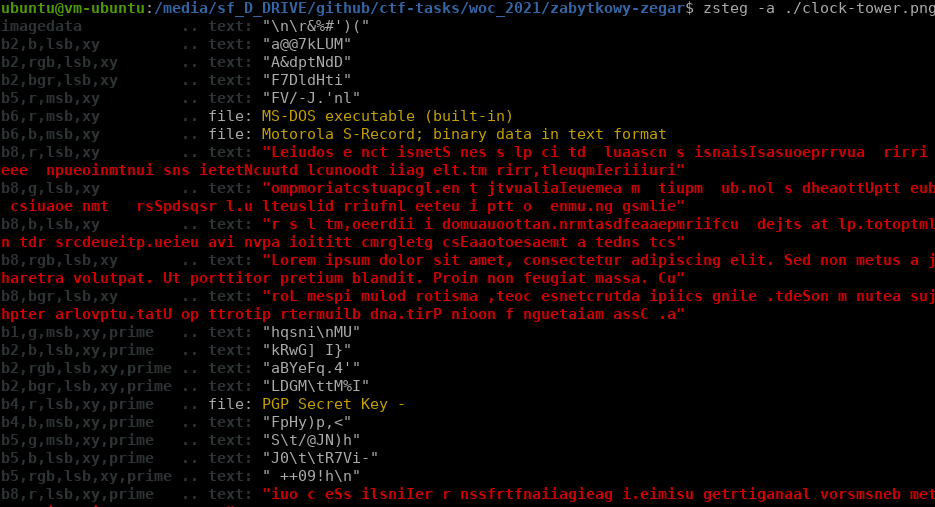

# Różdżka chaosu, Zabytkowy zegar, stegano

## Opis
"W przewodniku wielokrotnie wspominany jest zabytkowy zegar miejski, który znajduje się na ścianie zamku. Wypadałoby go zobaczyć..."

## Rozwiązanie

Odwiedzamy zegar miejski i pobieramy obrazek:

Używamy narzędzia `zsteg` i widzimy początek tekstu "Lorem Ipsum":

Niestety `zsteg` pokazuje tylko pierwsze 256 znaków w trybie `-a`. Dlatego też wykonujemy `zsteg -E 'b8,rgb,lsb' ./clock-tower.png | grep -a "WOC"` i odczytujemy flagę "WOC{nie-je-nie-pije-a-chodzi-i-bije}"
