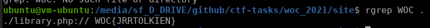

# Różdżka chaosu, Zdrój wiedzy, web

## Opis
"Wierzysz, że odpowiednie przygotowanie i obszerny research jest kluczem do sukcesu. Pora więc udać się do źródeł!"

## Rozwiązanie

"Pora więc udać się do źródeł!" brzmi jak flaga ukryta w źródle którejś z podstron. Strona udostępnia mechanizm podglądu plików .php poprzez endpoint `https://vallheru.rozdzka.securing.pl/source.php?file=plik.php`, gdzie zamiast `plik.php` podajemy nazwę pliku, który chcemy wyświetlić. Do pobrania wszystkich plików napisałem prosty scrapper, który przechodził przez kolejne strony, zbierał nazwy plików .php a na końcu je pobierał. Po zakończeniu scrappingu wystarczyło uruchomić: 

