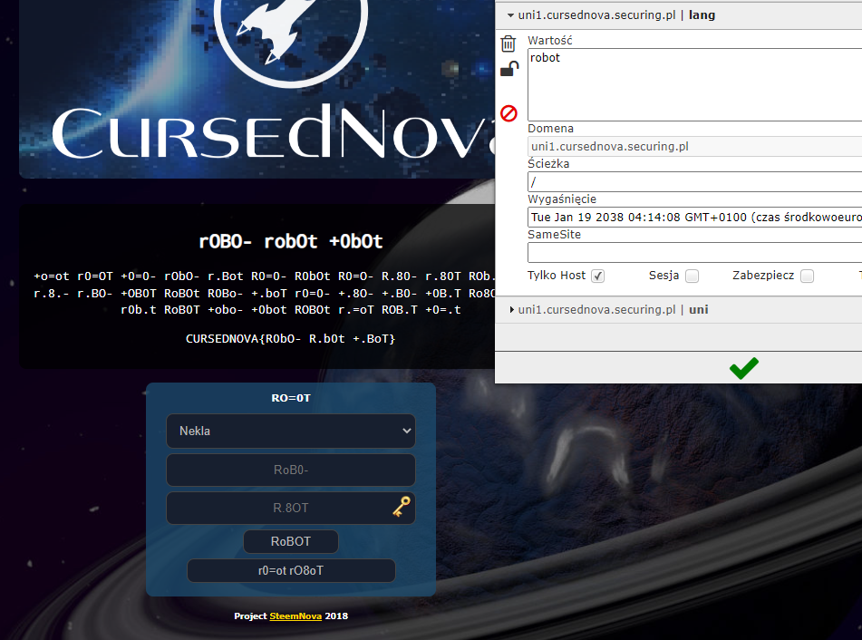

# CursedNova, Robot Language, web

## Description
Robots don't speak English... Does this app offer any normal languages, like, I don't know, the robot language?!

## Solution

Grepping the sources by `ROBOT_LANGUAGE` bring us to the `styles\templates\login\page.index.default.tpl` page, which contains the following html code:

```html
<section>
    <div class="indexlogo">
        
    </div>
    <div class="indextext">
        <h1>{$descHeader}</h1>
        <p class="desc">{$descText}</p>
        <p class="desc">{$LNG.W4_ROBOT_LANGUAGE}</p>
    </div>
</section>
```
flag will be displayed on the main page. Next step is checking where and how `$LNG` is initialized - it is initialized in `includes\common.php`:

```
 $LNG    = new Language($USER['lang']);
```

so we need to manipulate the `language` cookie. Setting its value to `robot` causes that page is displayed in the "Robot language":



So the extracted text is:

```
rOBO- robOt +0bOt
+o=ot r0=OT +0=0- rObO- r.Bot R0=0- R0bOt R0=O- R.80- r.80T ROb.T r.BO- r.8.- r.BO- +OB0T RoBOt R0Bo- +.boT r0=0- +.8O- +.B0- +0B.T Ro8OT +o8.t r0b.t RoB0T +obo- +0bot ROBOt r.=oT ROB.T +0=.t

CURSEDNOVA{R0bO- R.b0t +.BoT}
```

So it looks like some kind of encoding... After spending ~1h and trying to find some mapping between this and ASCII I decided to try submitting `CURSEDNOVA{R0bO- R.b0t +.BoT}` as a flag, well, it worked...


Flag: `CURSEDNOVA{R0bO- R.b0t +.BoT}`
