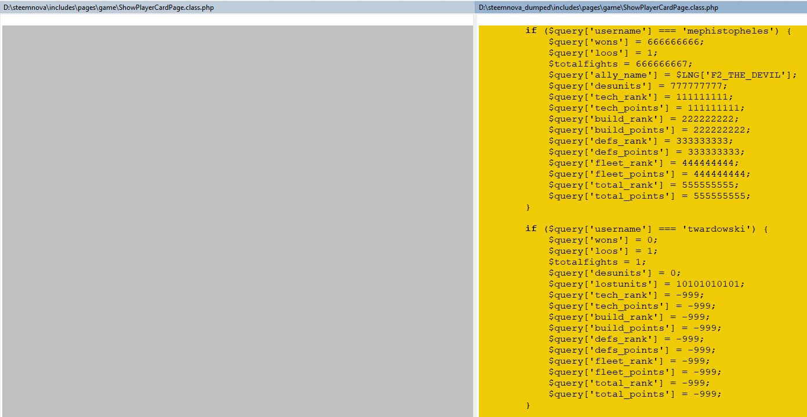
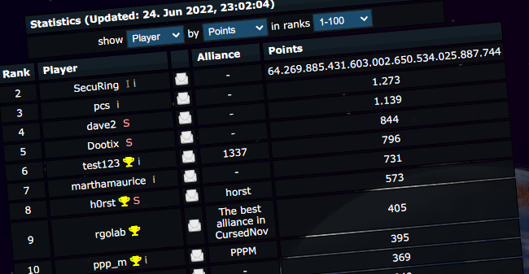
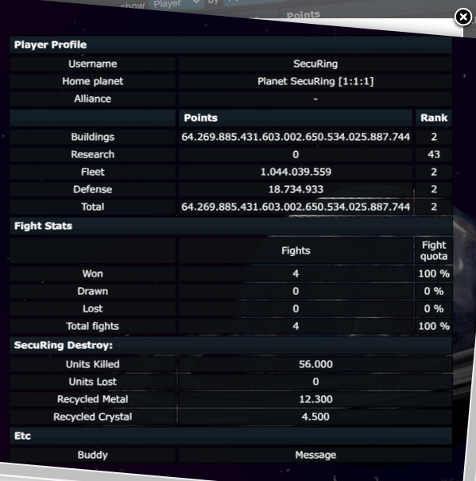
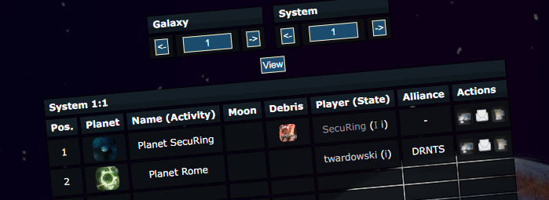
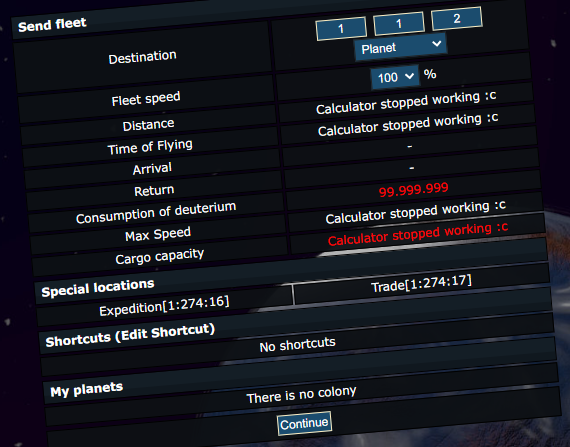
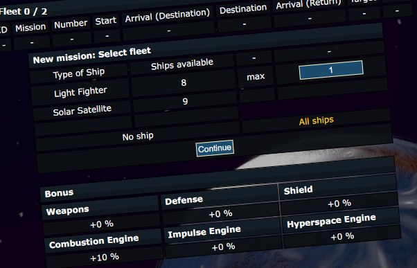
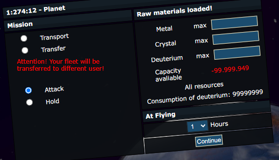
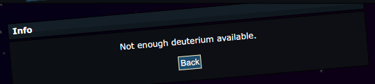
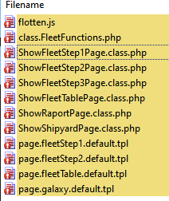
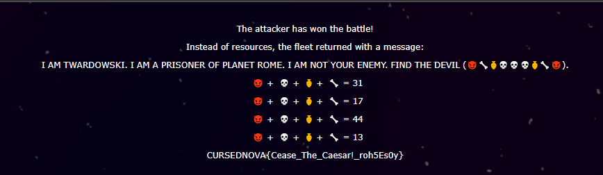

# CursedNova, The invasion, web 

## Description

Invade Planet Rome.

## Solution

First we need to figure out what are the coordinates of Planet Rome. During browsing the diff file I found this:



Okay, we know both important player names now, but let's continue the research.
I know that we can lookup the ranking ([statistics](https://uni1.cursednova.securing.pl/game.php?page=statistics)), so maybe there? I couldn't find twardowski and mephistopheles there. It turned out that somebody tuned the SQL query responsible for getting ranking data and filtered out two users mentioned earlier, so no luck here...



Well, it is possible to click on the user name and it will show the popup with users data:



and there is possibility to click on planet coords and after click, we see the Planet Rome and its coords (1,1,2).




So now let's attack this planet!
Unfortunately I don't have any ships to send, so quick google lookup and after building a couple of things on our planet I created 8 Light Fighters (Attack ships). Here is how the sending an attack looks like:









Not that simple... We have to analyze the diffs of source code and there is a few of them...




I noticed that there is a token, which is used to store/pass information between fleet views. File `includes\pages\game\ShowFleetStep1Page.class.php`. It is generated every time we visit the "Fleet" page.

```
    public function show()
    {
        ...
        $token = getRandomString();

        $_SESSION['fleet'][$token] = array(
            'time' => TIMESTAMP,
        );
        ...
```

The next code run after the `ShowFleetStep1Page` is `includes\pages\game\ShowFleetTablePage.class.php` and here is our deuterium cost set...:

```
    public function show()
    {
        ...
        $token = HTTP::_GP('token', '');
        $speed = HTTP::_GP('speed', 0);
        $f_consumption = HTTP::_GP('f_consumption', 99999999);

        $_SESSION['fleet'][$token]['f_consumption'] = $f_consumption;

        if ($f_consumption != 99999999) {
            FleetFunctions::GotoFleetStepOne('forged_fuel_consumption');
        }

        if (($_SESSION["godMissileOwned"] ?? false) == true) {
            $godMissile = true;
        } else {
            $godMissile = false;
        }
        ...
```

So as we can see - if we don't specify the `f_consumption` GET parameter it is defaulted to `99999999`, but if we set it to for example `1`, it will not work because of the check. So looks like we have to have set `f_consumption = 99999999` here. The important thing here is - code is setting passed value in the `$_SESSION['fleet'][$token]` which means BEFORE VALIDATION. Knowing that, we can change the amount of needed fuel when we are on the last screen (presented earlier). (As you can see there is something about `godMissile` but this is for the next task).

Now all we need to do is to open two browser tabs with "Fleet" page and do the following:
- tab1: enter the planet coords, specify number of ships (1), select mission type (Attack)
- use dev tools to get the form token (it is simply the hidden input field in the form, so we can extract it easily)
- tab2: open dev tools, replace form token with extracted from tab1, change the value of `f_consumption` field to `1` (field is already there, it is hidden, similar to the token field), specify the planet coords and click continue, we should see the following message which means that we failed on condition in `ShowFleetTablePage` file but the amount of needed fuel was set in the session: 
- tab1: click continue

After a while, we got the private message, which is a combat report. After clicking on it we see the following message:



Emoticon equation looks kinda broken, let's inspect the html source and check what is hidding here:

```html
<p><span style="opacity:0">1</span>😈 +<span style="opacity:0">3</span>💀 +<span style="opacity:0">6</span>⚱️ +<span style="opacity:0">1</span>🦴 = 31</p>
```
so it is an equation, but coefficients were hidden

The real equations look like this:

```
1😈 +3💀 +6⚱️+1🦴 = 31
3😈 +1💀 +4⚱️+0🦴 = 17
0😈 +5💀 +7⚱️+3🦴 = 44
1😈 +2💀 +0⚱️+1🦴 = 13
```

and the solution:
```
😈 = 1
💀 = 6
⚱️ = 2
🦴 = 0
```

But what does it mean...?

Flag: `CURSEDNOVA{Cease_The_Caesar!_roh5Es0y}`
