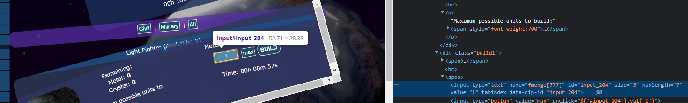
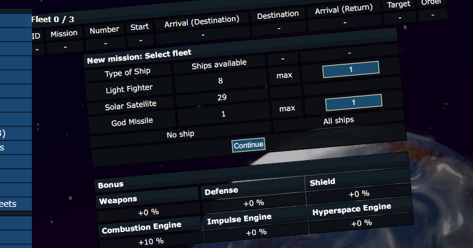
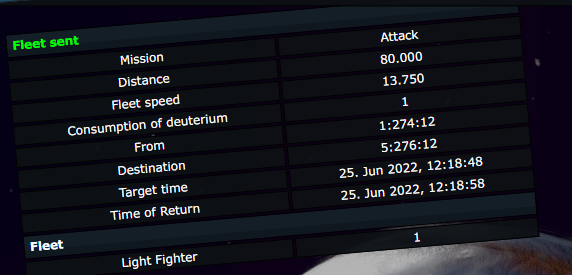
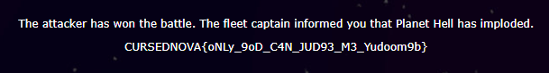

# CursedNova, The missile, web 

## Description

After further investigation you finally know the truth about CursedNova. There is no competition, there is no prize. It was stupid to believe the ads... Are you a prisoner like Twardowski now? Is it your punishment for being greedy and naive? Are you going to spend the rest of your life alone on this planet? How do you win with the Devil?!

This is not the end. Let's invade Planet Hell.

## Solution

From the previous challenge (The Devil), we know the planet coords - `Planet Hell [4:121:11]`. 
In order to invade the planet we will use the same trick as we used in "The invasion" challenge.

Sending the fleet in the exactly same way that we did in "The invasion" challenge is not working...
Also, the location of the "Planet Hell" is changing, so before an attack we have to check its current position.

After a while we got the following battle report:
```
The attacker has lost the battle. The fleet returned with a message:

I AM MEPHISTOPHELES. I AM INVINCIBLE. I AM THE POWER. I AM THE NIGHT. YOU WILL NOT BEAT ME!

IT IS IMPOSSIBLE TO BEAT ME USING THESE MERE HUMAN SHIPS!
```

So this has to be related to the god missile code seen in previous challenges. Quick look at code and we found this piece of code located in `includes\classes\missions\MissionCaseAttack.class.php`:

```
    public function TargetEvent()
    ...
            if (($_SESSION["godMissileSent"] ?? false) == true) {
                $combatResult['won'] = "a";
                $class = array('raportWin', 'raportLose');
            } else {
                $combatResult['won'] = "b";
                $class = array('raportLose', 'raportWin');
            }
```

If we don't send the god missile we lose the battle. Looking at `` we see:

```
    private function BuildAuftr($fmenge)
    {
        global $USER, $PLANET, $reslist, $resource;

        $Missiles = array(
            502 => $PLANET[$resource[502]],
            503 => $PLANET[$resource[503]],
        );

        foreach ($fmenge as $Element => $Count) {
            if ($Element === 777) {
                $_SESSION["godMissileOwned"] = true;
                echo ("Good job! You built a God Missile. Be careful though - it is a volatile ship and will disappear at the end of your session.\n\n");
            } else {
                $_SESSION["godMissileOwned"] = false;
            }
            ...
            
            
    public function show()
    ...
        $buildTodo = HTTP::_GP('fmenge', array());
        $action = HTTP::_GP('action', '');

        $NotBuilding = true;
        if (!empty($PLANET['b_building_id'])) {
            $CurrentQueue = unserialize($PLANET['b_building_id']);
            foreach ($CurrentQueue as $ElementArray) {
                if ($ElementArray[0] == 21 || $ElementArray[0] == 15) {
                    $NotBuilding = false;
                    break;
                }
            }
        }

        $ElementQueue = unserialize($PLANET['b_hangar_id']);
        if (empty($ElementQueue)) {
            $Count = 0;
        } else {
            $Count = count($ElementQueue);
        }

        if ($USER['urlaubs_modus'] == 0 && $NotBuilding == true) {
            if (!empty($buildTodo)) {
                $maxBuildQueue = Config::get()->max_elements_ships;
                if ($maxBuildQueue != 0 && $Count >= $maxBuildQueue) {
                    $this->printMessage(sprintf($LNG['bd_max_builds'], $maxBuildQueue));
                }

                $this->BuildAuftr($buildTodo);
            }
            ...
```

Creating a god missile is super simple, just replace the ship id in the shipyard form:



And click the "Build" button. At the top we see the following message: `Good job! You built a God Missile. Be careful though - it is a volatile ship and will disappear at the end of your session.`, which basically means that we have built our god missile.

Now it is enought to attack the "Planet Hell" with it.





After a while, we get the battle report saying that we defeated mephistopheles!



Flag: `CURSEDNOVA{oNLy_9oD_C4N_JUD93_M3_Yudoom9b}`
