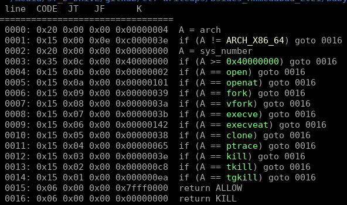
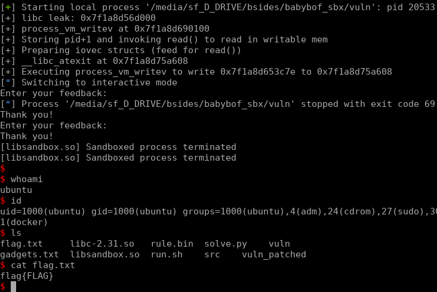

# BSIDES AHMEDABAD 2021, babyBOF:SBX, pwn

## Solution
* obvious BOF in `vuln` program (`scanf`)
* libsandbox is preloaded and it does a `fork` to spawn new process which is waiting for `vuln` program to complete
* leak libc base addr (it is exactly the same in both processes (vuln and watcher))
* check seccomp rules located in [rule.bin](./rule.bin)



* `process_vm_writev` is not banned so we can use it to write into watcher's memory

```c
ssize_t process_vm_writev(pid_t pid,
                          const struct iovec *local_iov,
                          unsigned long liovcnt,
                          const struct iovec *remote_iov,
                          unsigned long riovcnt,
                          unsigned long flags)
```

* prepare gadgets for setting registers: `rdi`, `rsi`, `rdx`, `rcx`, `r8`, `r9`
* use writable segment of `vuln` program to prepare two `iovec` structs
* obtain self pid and add one to id (it will become pid of watcher process)
* call `process_vm_writev` to write one_gadget to libc exit hooks



Solve script (really unsable): [solve.py](./solve.py)
