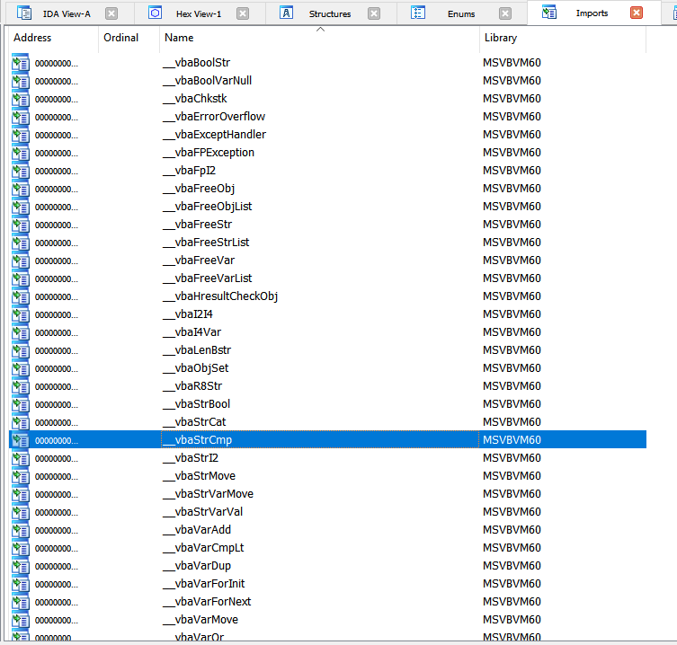
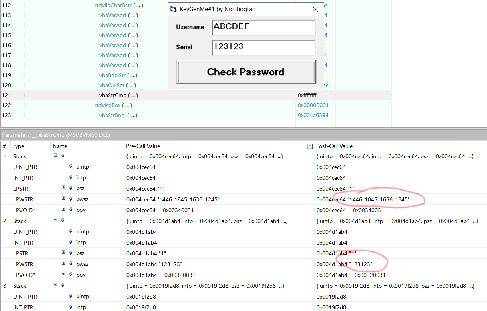
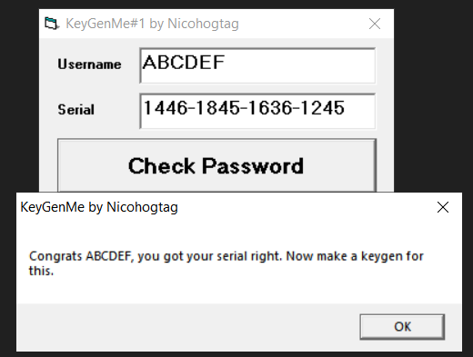
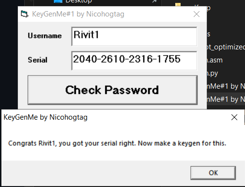

[Challenge](https://crackmes.one/crackme/5ab77f5333c5d40ad448c0d6)

## Solution
Another Visual Basic crackme :( Binary asks about username and serial, so probably we have to write keygen for it.
Load binary into IDA and check imports:



We see some kind of strcmp function. Let's use API monitor (http://www.rohitab.com/apimonitor) to hook this function and see what it compares.



Seems like application comparing our serial with some kind of magic value. If we try to provide "1446-1845-1636-1245" as serial for username ABCDEF then we got it! (we also know serial format)



Okay, so lets hook every vba function which app uses and run it again to see what is going on inside.
After digging in quite long list of api calls I figured out that program sums ascii values of letters from username, but it does it in weird way - convert letter to ascii value, then convert this value to decimal string and convert decimal string to floating point number, but... I figured out that this app is using native code, so we can decompile binary to get C-like code. Let's use well known decompiler ;) Decompiled function is in [algo.c](./algo.c) file.
Few notes:
* nice document [vx underground](https://vx-underground.org/archive/Symantec/w32-changeup-12-en.pdf)
* `__vbaFpI2` - converts double to integer
* `_vbaStrI2` - string to int
* `_vbaStrMove` - move sth to destination (probably string)
* `_vbaVarAdd` - adds two variants
* `_vbaStrVarVal` - converts variant to string


algo.c contains while loop which sums ascii values of the username letters and also it contains four repetitions of quite similar piece of code - it must be logic which is responsible for calculating four serial pieces.
Example chunk:
```c
  v59 = 7 * v6;   		            //v6 is probably accumulated value (sum of ascii values)
  if ( !is_mul_ok(7u, v6) )         //??          
    goto LABEL_58;                  //?? 
  v60 = __OFADD__(56, v59);         //??          
  v61 = v59 + 56;                   //adding 56
  if ( v60 )                        //??
    goto LABEL_58;                  //??
  v121 = v61;
  v120 = v61;
  v62 = v120;
  if ( dword_404000 )               //always zero?
    (adj_fdiv_m64)(0, 0x40000000);  //??
  else
    v62 = v120 / 2.0;               //dividing by two, still float
  if ( (v63 & 0xD) != 0 )           //??
LABEL_59:                           //??
    (j___vbaFPException)();         //??
  v67 = (_vbaFpI2)(v163, v164, v62); //convert float (v62) to integer
  (_vbaStrI2)(v67);                 //int to str, result in eax?
  v10(v150, v143);                  //__vbaVarMove
  v144 = 4;
  v143[0] = 2;
  v68 = (_vbaStrVarVal)(&v148, v150, 1, v143);   //v68 contains part of serial (as string)
  v142 = (rtcMidCharBstr)(v68, v161, v162);      //??
  v141[0] = 8;                                   //??
  v10(v150, v141);                               //??
  (_vbaFreeStr)(&v148);
  (_vbaFreeVar)(v143);
```

I checked under x32dbg and v6 is sum of ascii values, so we do transformations on this sum in every chunk (to calculate serial parts). Now we can write simple keygen and test it!




