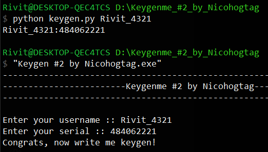

[Challenge](https://crackmes.one/crackme/5ab77f5333c5d40ad448c0d5)

## Solution
This crackme was written in c++.
Challenge seems kinda buggy if you provide nick, which is less than ten characters but if we provide 10 characters long nickname it should work ;)

First of all - load .exe into IDA v7, quick analysis and algorithm is pretty clear. Now write keygen in python and run it like this:
`python keygen.py your__nick`

Result:

