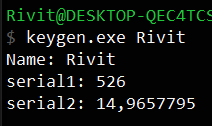

[Challenge](https://crackmes.one/crackme/5ab77f5333c5d40ad448c0d2)

## Solution
Binary is packed with UPX and Aspack, so we have to unpack it.
* [AspackDie](https://www.aldeid.com/wiki/AspackDie)
* For UPX unpacking I used x32dbg + Scylla plugin and dumped PE after code unpacked itself.

Quick analysis and we know that binary is using Visual Basic. VB Decompiler Lite gives us disassembled functions (our target is OK button handler). I used some tool with `vitamine` and got decompiled VB code ;)

```c
Private Sub ji_Click() '405378
  'Data Table: 402384
  Dim var_168 As Variant
  loc_40511D: Me.cmdWelcome.Caption = "Time to test"
  loc_40512A: var_98 = 112 'Variant
  loc_405133: var_A8 = 1564 'Variant
  loc_40513C: var_B8 = 1464 'Variant
  loc_40515A: name_field_len = CVar(Len(name_field.Text)) 'Variant
  loc_405185: If Not((name_field.Text = "Ab")) Then
  loc_40518D:   i = 0 'Variant
  loc_4051A9:   var_19C = CVar(name_field.Text) 'Variant
  loc_4051B0:   ' Referenced from: 405246
  loc_4051C3:   If CBool(Not (var_19C = vbNullString)) Then
  loc_4051D2:     i = (i + 1) 'Variant
  loc_405224:     var_1FC = (var_1FC + CVar(Asc(CStr(Left(Left(var_19C, CLng(i)), 1))))) 'Variant
  loc_405242:     var_19C = Right(var_19C, CLng((name_field_len - i))) 'Variant
  loc_405246:     GoTo loc_4051B0
  loc_405249:   End If

  loc_405252:   If (var_1FC = CVar(Asc(CStr(Left(Left(var_19C, CLng(i)), 1))))) Then
  loc_405255:     End
  loc_405257:     GoTo loc_40525A
  loc_40525A:     ' Referenced from: 405257
  loc_40525A:   End If

' sth is broken with decompiler, var_E8 should be on the -10 place....
  loc_405290:   var_108 = (((var_98 * var_A8) Xor var_B8 - var_E8) - 10) 'Variant
  loc_40529E:   var_128 = (var_108 * var_1FC) 'Variant
  loc_4052D4:   var_148 = (CVar(Val(serial_field.Text)) * var_108) 'Variant
  loc_4052E1:   If (var_148 = CVar(Val(serial_field.Text))) Then
  loc_4052E4:     End
  loc_4052E9:   Else
  loc_4052F9:     If CBool(Not (var_148 < var_128)) Then
  loc_40530F:       var_168 = 11
  loc_40532C:       If CBool(Not ((var_148 + var_168) > (var_128 + 11))) Then
  loc_405332:         Me.Hide
  loc_405345:         Homo.Show var_168, var_20C
  loc_40534A:         Exit Sub
  loc_40534B:       End If
  loc_40534B:       End
  loc_40535B:       df.Show var_168, var_20C
  loc_405360:     End If
  loc_405360:   End If
  loc_405360:   End
  loc_405362: End If
  loc_405370: Me.Show var_168, var_20C
  loc_405375: Exit Sub
End Sub
```


Serial = Sum of ascii values of all letters in name field \
e.g. \
Name: Rivit \
Serial: 526 


Now we are in stage 2 but I have no idea how to solve it. We have simple input box with button. Handler code for button:
```c
Private Sub we_Click() '405704
  'Data Table: 401CB0
  Dim var_88 As Variant
  Dim var_1A8 As Variant
  Dim var_1AC As String
  Dim var_23C As Integer
  Dim var_1FC As Variant
  loc_405415: Me.we.Caption = vbNullString
  loc_405422: var_98 = 144 'Variant
  loc_40542B: var_A8 = 135 'Variant
  loc_405434: var_B8 = 1234 'Variant
  loc_405445: var_1AC = input_box.Text

  loc_405458: If (var_1AC = vbNullString) Then
  loc_40545B:   End
  loc_40545D:   GoTo loc_405460
  loc_405460:   ' Referenced from: 40545D
  loc_405460: End If
  loc_405472:  = .Text

  loc_4054C3: var_F8 = ((var_B8 Mod var_98 Xor var_A8) + (CVar(Val(var_1AC)) * 100)) 'Variant
  loc_4054E1: var_1CC = CVar(Len(input_box.Text)) 'Variant
  loc_40550C: var_1EC = CVar(input_box.Text) 'Variant

  loc_405513: Do 'loop at: 4055E3
  loc_40551F: var_1DC = (0 + 1) 'Variant
  loc_40557B: var_22C = CVar(Asc(CStr(Left(Left(CVar(input_box.Text), CLng(var_1DC)), 1)))) 'Variant
  loc_4055A2: If CBool((var_22C < 48) Or (var_22C > 57)) Then
  loc_4055B2:   Me.we.Caption = "Only intergers"
  loc_4055BA:   Exit Sub
  loc_4055BB: End If
  loc_4055E3: Loop Until (Right(var_1EC, CLng((var_1CC - var_1DC))) = var_1A8) 'do at: 405513

  loc_405653: var_168 = Left(Val(blot.sh.Text), 3) 'Variant
  loc_405661: var_128 = Right(Right(Right(var_1EC, CLng((var_1CC - var_1DC))), CLng((var_1CC - var_1DC))), CLng((var_1CC - var_1DC))) * var_168 'Variant
  loc_40567F: var_178 = ((var_F8 * var_168) - 18) 'Variant
  loc_405693: If CBool(Not (var_128 < var_178)) Then
  loc_4056DD:   If CBool(Not ((Val(CStr(var_128)) + 20) > (var_178 + 20))) Then
  loc_4056E3:     Me.Hide
  loc_4056F6:     Kanel.Show var_1A8, 57
  loc_4056FE:   Else
  loc_4056FE:     End
  loc_405700:   End If
  loc_405700:   Exit Sub
  loc_405701: End If
  loc_405701: End
  loc_405703: Exit Sub
End Sub
```

After cleaning it up:
```c
  loc_405653: var_168 = Left(Val(SERIAL_STAGE1), 3) 'Variant
  loc_4054C3: var_F8 = 15 + (Val(NAME_FIELD_TEXT) * 100) 'Variant
  loc_405661: var_128 = SERIAL_STAGE2 * var_168 'Variant
  loc_40567F: var_178 = (var_F8 * var_168) - 18 'Variant
  loc_405693: If var_128 == var_178 Then
  loc_4056E3:   Me.Hide
  loc_4056F6:   Kanel.Show var_1A8, 57
```

Unfortunately z3 solver was not be able to solve it, probably challenge is unsolvable (I'm quite sure about it, because I spent like ~23h in the debugger :) )

EDIT: it is solvable :D I didn't think there could be floating point numbers! Anyway huge thanks to ToMKoL (https://forum.tuts4you.com/profile/61247-tomkol/)

He analyzed this crackme and wrote keygen and tutorial (available here https://forum.tuts4you.com/topic/42903-keygen-for-simple-vb-keygenme-challenge/)

I also wrote another keygen in python, but it had problems with dealing with floats, so I rewrote keygen in C [keygen.c](./keygen.c).


Example working credentials:




