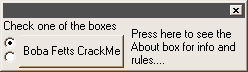
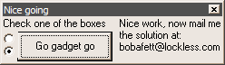

[Challenge](https://crackmes.one/crackme/5ab77f5333c5d40ad448c0d3)

## Solution
Binary is packed with UPX and Aspack, so we have to unpack it.
* [AspackDie](https://www.aldeid.com/wiki/AspackDie)
* For UPX unpacking I used x32dbg + Scylla plugin and dumped PE after code unpacked itself.

Lets run the crackme:

After this I put binary into this program: [Detect It Easy](https://horsicq.github.io/) and it shows that this crackme is written in Visual Basic but compiled into native code (not P-code).

Quick look in ghidra and we see that crackme opens file `C:\Windows\sailor.hk`
Let's continue with tracing crackme under debugger. For this I used windows XP VM machine (because problems with SysTray.ocx)  and x32dbg. 
After a while I figured out that it reads data from this file and checks if it's equal to: "121230302829". Great, so we passed first stage. Second stage was about radio button selection. Super simple - when clicking on button, second radio checkbox should be checked. That's it

[sailor.hk](./sailor.hk)
