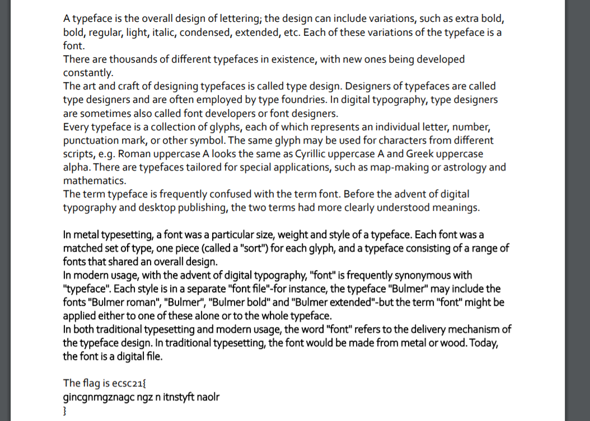
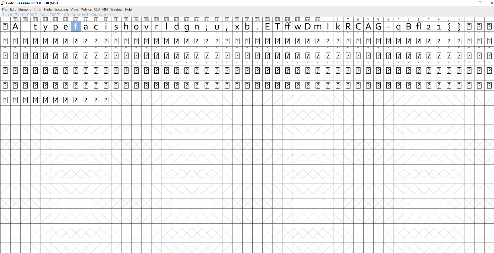
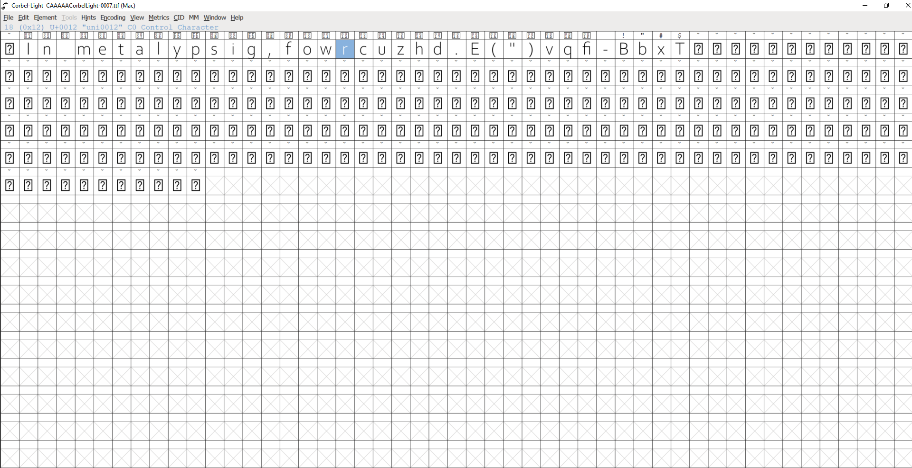
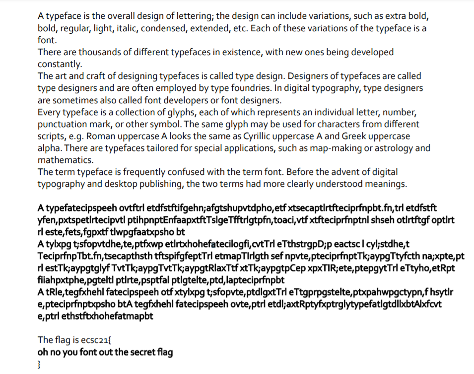

# European Cyber Security Challenge Eliminations 2021, Fontain of youth, forensics

## Description
Cosmic ray hit my CPU when I was saving my precious PDF file, and now instead of the flag there is some gibberish!

## Solution
We got a pdf file:



We see that flag is somehow destroyed... First thought - fonts objects.
Using `pdf-parser.py` from [DidierStevensSuite](https://github.com/DidierStevens/DidierStevensSuite) I dumped list of objects in PDF with `./DidierStevensSuite-master/pdf-parser.py ./fontain.pdf`. Here is the full output: [pdf-parser-output.txt](./pdf-parser-output.txt).

We can spot two fonts:
```
obj 7 0
 Type: /FontDescriptor
 Referencing: 5 0 R

  <<
    /Type /FontDescriptor
    /FontName /CAAAAA+CorbelLight
    /Flags 4
    /FontBBox [-485 -239 1102 979]
    /ItalicAngle 0
    /Ascent 952
    /Descent -268
    /CapHeight 978
    /StemV 80
    /FontFile2 5 0 R
  >>
...

obj 12 0
 Type: /FontDescriptor
 Referencing: 10 0 R

  <<
    /Type /FontDescriptor
    /FontName /BAAAAA+Corbel
    /Flags 4
    /FontBBox [-553 -239 1109 952]
    /ItalicAngle 0
    /Ascent 952
    /Descent -268
    /CapHeight 951
    /StemV 80
    /FontFile2 10 0 R
  >>
```
The most interesting part of it are these two lines:
```
/FontFile2 5 0 R
/FontFile2 10 0 R
```

Based on this we can infer that fonts are stored in objects 5 and 10. Let's extract them using also `pdf-parser.py` - `./DidierStevensSuite-master/pdf-parser.py -o 5 -d BAAAAACorbel.ttf -f ./fontain.pdf`
Options explanation:
```
  -f, --filter          pass stream object through filters (FlateDecode,
                        ASCIIHexDecode, ASCII85Decode, LZWDecode and
                        RunLengthDecode only)
  -o OBJECT, --object=OBJECT
                        id(s) of indirect object(s) to select, use comma (,)
                        to separate ids (version independent)
  -d DUMP, --dump=DUMP  filename to dump stream content to
```

Now we open the dumped files with [fontforge](https://fontforge.org/en-US/)





Now we need to do mapping between CAAAAACorbelLight and BAAAAACorbel in order to decode flag content "gincgnmgznagc ngz n itnstyft naolr". I did it manually and used python script ([decode.py](./decode.py)) but there is a smarter method ;)

pdf-parser has option to write pdf as python code. We can do it using this option:
```
  -g, --generate        generate a Python program that creates the parsed PDF
                        file
```

Output is located in [pdf-generated.py](pdf-generated.py). All we need now is to replace fonts configuration here:

```py
oPDF.indirectobject(7, 0, '<</Type/FontDescriptor/FontName/CAAAAA+CorbelLight\n/Flags 4\n/FontBBox[-485 -239 1102 979]/ItalicAngle 0\n/Ascent 952\n/Descent -268\n/CapHeight 978\n/StemV 80\n/FontFile2 5 0 R\n>>')
oPDF.indirectobject(9, 0, '<</Type/Font/Subtype/TrueType/BaseFont/CAAAAA+CorbelLight\n/FirstChar 0\n/LastChar 36\n/Widths[455 216 506 194 812 483 317 475 212 448 518 386 212 518 222 309\n514 678 327 436 492 423 506 518 240 536 294 332 294 435 514 504\n333 565 518 395 541 ]\n/FontDescriptor 7 0 R\n/ToUnicode 8 0 R\n>>')
```

Just simply copy-paste strings from:
```py
oPDF.indirectobject(12, 0, '<</Type/FontDescriptor/FontName/BAAAAA+Corbel\n/Flags 4\n/FontBBox[-553 -239 1109 952]/ItalicAngle 0\n/Ascent 952\n/Descent -268\n/CapHeight 951\n/StemV 80\n/FontFile2 10 0 R\n>>')
oPDF.indirectobject(14, 0, '<</Type/Font/Subtype/TrueType/BaseFont/BAAAAA+Corbel\n/FirstChar 0\n/LastChar 45\n/Widths[462 635 200 347 479 530 497 317 489 438 231 404 532 533 461 334\n231 535 530 527 266 517 263 455 535 264 551 555 604 711 670 828\n245 486 591 589 635 667 332 523 593 536 510 448 300 300 ]\n/FontDescriptor 12 0 R\n/ToUnicode 13 0 R\n>>')
```

The final python script is in [pdf-generated-modified.py](./pdf-generated-modified.py) file. Running it with the following command `python2 pdf-generated-modified.py flag.pdf` yields file `flag.pdf` which contains flag in plaintext:




Flag: ecsc21{oh no you font out the secret flag}
