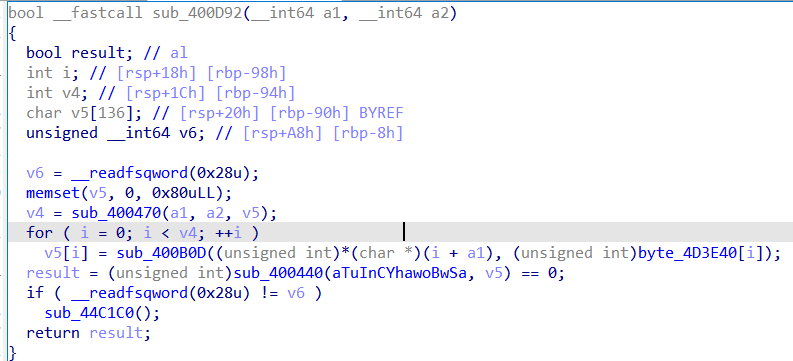

# European Cyber Security Challenge Eliminations 2021, Novice, re

## Description
Not a baby anymore, but not yet an adult.

## Solution
In this challenge we have statically linked binary. Opening it in IDA and checking `start` function will result with the following:


`sub_4012B0` is probably `__libc_start_main` and the first parameter is the main function (`sub_400E7B`).


The marked function is `scanf`, but IDA shows some garbage parameters. Let's deep into `sub_400D92`.




Looks like easy xor. We are xoring `byte_4D3E40` array with our input and check if output is equal to `aTuInCYhawoBwSa`. If we want to reverse it we can just xor two arrays `byte_4D3E40` with `aTuInCYhawoBwSa`. But it gives some garbage... During the dynamic analysis I figured out that this function is not called :( - something before main function modified the code. Instead of it the following function is called:


```c
__int64 __fastcall sub_400D78(__int64 a1)
{
  return sub_400B8F(a1);
}

__int64 __fastcall sub_400B8F(__int64 a1)
{
  __int64 result; // rax
  unsigned int v2; // [rsp+14h] [rbp-CCh]
  unsigned int v3; // [rsp+18h] [rbp-C8h]
  unsigned int i; // [rsp+1Ch] [rbp-C4h]
  char v5[35]; // [rsp+20h] [rbp-C0h]
  char v6[149]; // [rsp+43h] [rbp-9Dh] BYREF
  unsigned __int64 v7; // [rsp+D8h] [rbp-8h]

  v7 = __readfsqword(0x28u);
  v5[0] = 21;
  v5[1] = 102;
  v5[2] = 16;
  v5[3] = 112;
  v5[4] = 109;
  v5[5] = 57;
  v5[6] = 114;
  v5[7] = 97;
  v5[8] = 51;
  v5[9] = 117;
  v5[10] = 125;
  v5[11] = 98;
  v5[12] = 26;
  v5[13] = 2;
  v5[14] = 58;
  v5[15] = 49;
  v5[16] = 9;
  v5[17] = 28;
  v5[18] = 112;
  v5[19] = 108;
  v5[20] = 113;
  v5[21] = 51;
  v5[22] = 8;
  v5[23] = 69;
  v5[24] = 35;
  v5[25] = 58;
  v5[26] = 58;
  v5[27] = 12;
  v5[28] = 98;
  v5[29] = 91;
  v5[30] = 37;
  v5[31] = 81;
  v5[32] = 79;
  v5[33] = 56;
  v5[34] = 25;
  qmemcpy(v6, "+|\\", 3);
  memset(&v6[13], 0, 0x80uLL);
  v2 = sub_400B24(61767LL);
  v3 = 1;
  for ( i = 0; i <= 0x25; ++i )
  {
    v2 = sub_400B5A(v2, (unsigned __int8)v5[i]);
    if ( v2 != *(char *)((int)i + a1) )
      v3 = 0;
  }
  result = v3;
  if ( __readfsqword(0x28u) != v7 )
    sub_44C1C0();
  return result;
}

__int64 __fastcall sub_400B24(int a1)
{
  return (57005 * a1 + 48879) % 0x80u;
}

__int64 __fastcall sub_400B5A(unsigned int a1, int a2)
{
  int i; // [rsp+14h] [rbp-4h]

  for ( i = 0; i < a2; ++i )
    a1 = sub_400B24(a1);
  return a1;
}
```

Now it's enough to write rev script [solve.py](./solve.py) and run it to get the flag.

Flag: ecsc21{novice_also_known_as_INITiate!}

But how the binary fooled me? Let's check cross references to the `main` function and we find `sub_400F0F` which has the following line:

```c
  *((_BYTE *)main + 0x57) -= 0x1A;
```

So the binary patches itself by subtracting 0x1A from one byte of the main function. After looking at hex we see that this code is modifies a `call` instruction.


before:
```
E8 BC FE FF FF ; call 0x400d92
   ^^
```

after:
```
E8 A2 FE FF FF ; call 0x400d78
   ^^
```

