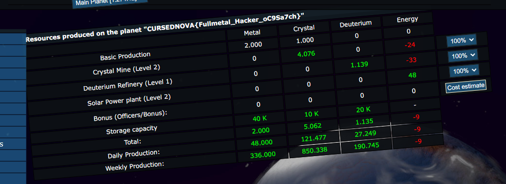

# CursedNova, 1337, web

## Description
Legend has it that a person who has 1337 metal in their storage will receive a blessing.

## Solution

Quick look at file named `includes\pages\game\ShowResourcesPage.class.php` and we see the following code:

```
        if (ceil($PLANET[$resource[901]]) == "1337") {
            $PLANET["name"] = $LNG['W3_1337'];
        }

        $this->assign(array(
            'header' => sprintf($LNG['rs_production_on_planet'], $PLANET['name']),
            'prodSelector' => $prodSelector,
            'productionList' => $productionList,
            'basicProduction' => $basicProduction,
            'totalProduction' => $totalProduction,
            'bonusProduction' => $bonusProduction,
            'dailyProduction' => $dailyProduction,
            'weeklyProduction' => $weeklyProduction,
            'storage' => $storage,
        ));
```

they didn't lie - we have to have exactly 1337 units of metal, so by using the method called "F5" we can easily get the flag (it will be displayed in the header of the table).


Flag: `CURSEDNOVA{Fullmetal_Hacker_oC9Sa7ch}`
