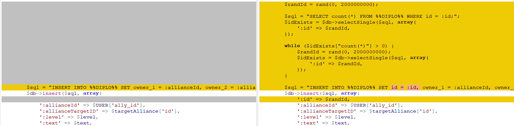
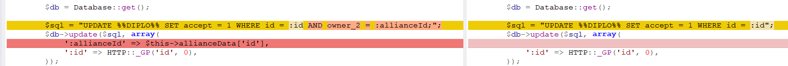
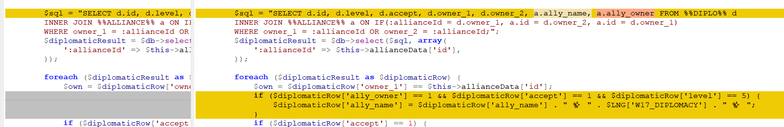
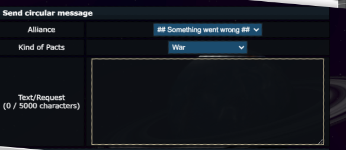

# CursedNova, Diplomacy, web 

## Description

Create a war pact with Twardowski's alliance. The user interface is kinda broken, but it definitely won't stop you!

The pact must be accepted in order to receive the flag.

You can manage your pacts in Alliance → Managing Alliance → Diplomacy of Alliance.

## Solution

Let's analyze the diff of the `includes\pages\game\ShowAlliancePage.class.php` file.

First difference is in the: `adminDiplomacyCreateProcessor` func:

```
        $randId = rand(0, 2000000000);

        $sql = "SELECT count(*) FROM %%DIPLO%% WHERE id = :id;";
        $idExists = $db->selectSingle($sql, array(
            ':id' => $randId,
        ));

        while ($idExists["count(*)"] > 0) {
            $randId = rand(0, 2000000000);
            $idExists = $db->selectSingle($sql, array(
                ':id' => $randId,
            ));
        }

        $sql = "INSERT INTO %%DIPLO%% SET id = :id, owner_1 = :allianceId, owner_2 = :allianceTargetID, level    = :level, accept = 0, accept_text = :text, universe    = :universe";
        $db->insert($sql, array(
            ':id' => $randId,
            ':allianceId' => $USER['ally_id'],
            ':allianceTargetID' => $targetAlliance['id'],
            ':level' => $level,
            ':text' => $text,
            ':universe' => Universe::current(),
        ));

        $this->sendJSON(array(
            'error' => false,
            'message' => $LNG['al_diplo_create_done'],
        ));
```



So when we create the diplomacy request it gets random id.

Next differences are:





So looks like we can accept every pact request if we know its ID and once accepted, the flag will be printed as an alliance name.


When we try to create an pact, we cannot select the alliance from the dropdown:



so instead of UI we can use the API url - `https://uni1.cursednova.securing.pl/game.php?page=alliance&mode=admin&action=diplomacyCreateProcessor&ajax=1&ally_id=ALLYID&level=5&text=asd` where `ALLYID` is the id of the alliance with which we want to make a pact and we don't know this... so we can brute force it.
Next step is accepting all of the pacts, so we can the use following url: `https://uni1.cursednova.securing.pl/game.php?page=alliance&mode=admin&action=diplomacyAccept&id=PACT_REQUEST_ID`, where `PACT_REQUEST_ID` is the id of the request and we can find it by inspecting the HTML source of alliance page.
Having this, we can write simple script and get the flag [solve](./solve.py).

Flag: `CURSEDNOVA{It's_a_war_Twardowski!_ahXu2thu}`
