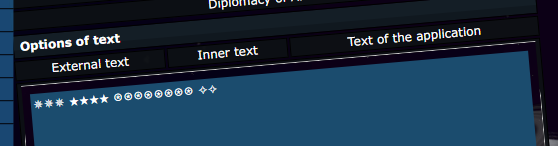

# CursedNova, Morale, web 

## Description
Change the text in the internal area of your alliance to The best alliance in CursedNova to boost morale of your group.

## Solution

In `includes\pages\game\ShowAlliancePage.class.php` we see some sanitization of "Inner text"

```
                    $text = sanitizeAllianceInternalText($text);
                    if ($text === "The best alliance in CursedNova") {
                        $text = $text . "\n" . $LNG['W16_MORALE'];
                    }
```

Let's try setting `The best alliance in CursedNova` as an internal text.



Our text was changed to: `✵✵✵ ★★★★ ⍟⍟⍟⍟⍟⍟⍟⍟ ✧✧`. Looks like sanitizer is replacing first four words with some other characters, and removing `CursedNova` word completely.
We can make use of it to bypass the sanitizer - it is enough to pass `ThCursedNovae beCursedNovast alCursedNovaliance iCursedNovan CursedCursedNovaNova` as the text.

PS. I've spent a lot of time on this trying to bypass sanitizer with some UTF8 tricks...

Flag: `CURSEDNOVA{Pendant_of_Courage_rohkah5U}`
