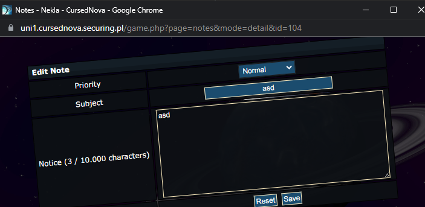

# CursedNova, Note, web 

## Description
It's good to know your enemy. Can you access Twardowski's notes?

## Solution

After visiting the "Notes" and creating one note we see that id of the note is shown in the url

Knowing that, we can try to iterate over all of ids and look for flag string. Solver [solve.py](./solve.py)

Flag: `CURSEDNOVA{Twardowski's_curse_iemeV0ou}`
