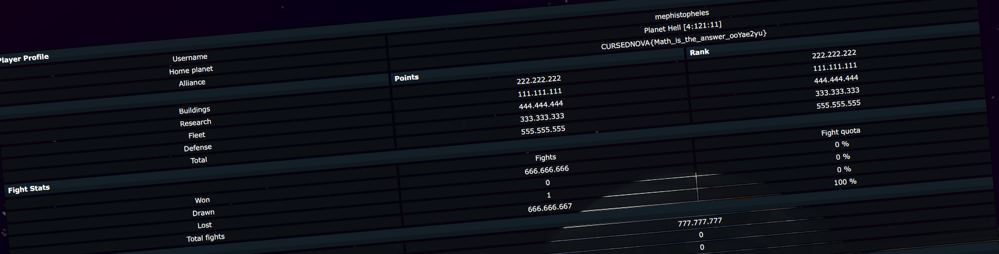

# CursedNova, The devils, web 

## Description

Your ships returned. You finally managed to invade Planet Rome... 10 days ago. You are still waiting for the prize, the fanfares, heck, you're still waiting for the return flight. You want to go home. The Earth won't answer, you can't contact the CursedNova organizers. And the strange message in the battle report... What is going on?!

Let's try to find the Devil.

## Solution

In previous challenge (The invasion) we received a report with some kind of rebus. We solved the equations but what is next?

Report says:

`FIND THE DEVIL (😈🦴⚱️💀💀💀⚱️🦴😈)`, so substituting the equation solutions to this pattern we get: `102666201`. This is probably the player ID.
Using this link [player](https://uni1.cursednova.securing.pl/game.php?page=playerCard&id=102666201#) we can see the details of player called `mephistopheles`.

Flag: `CURSEDNOVA{Math_is_the_answer_ooYae2yu}`
