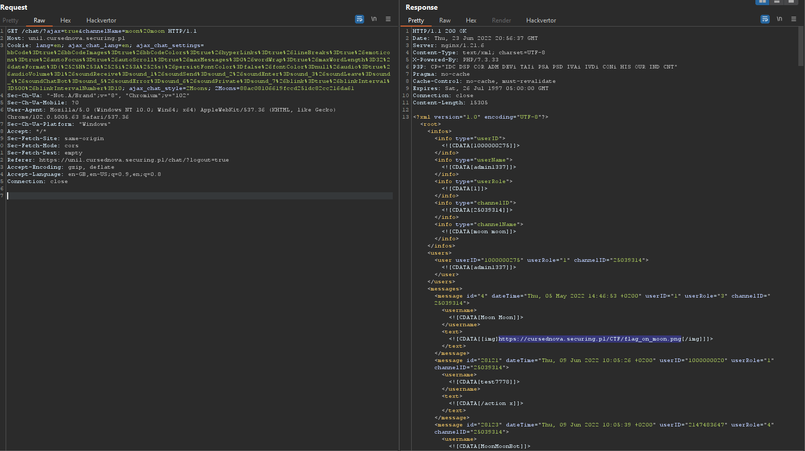

# CursedNova, The hidden entry, web 

## Description

Moon moon cannot into space. Make sure chat channel names don't contain any whitespace.

## Solution

We need to investigate chat logic more deeply. There are some commands like : `/quit`, `/nick`, `/join` but they don't accept the arguments with spaces (either they split text by space or replace space with underscore).
Chat client is using Javascript to perform requests. 

After long analysis I found the flow which allows us to send a request which will allow us to set wanted channel name (`moon moon`). Flow looks like this:

File: `chat\lib\class\AJAXChat.php`
```
    public function initialize()
    {
        // Initialize configuration settings:
        $this->initConfig();

        // Initialize the DataBase connection:
        $this->initDataBaseConnection();

        // Initialize request variables:
        $this->initRequestVars();

        // Initialize the chat session:
        $this->initSession();

        // Handle the browser request and send the response content:
        $this->handleRequest();
    }
    
    public function initSession()
    {
        // Start the PHP session (if not already started):
        $this->startSession();

        if ($this->isLoggedIn()) {
            // Logout if we receive a logout request, the chat has been closed or the userID could not be revalidated:
            if ($this->getRequestVar('logout') || !$this->isChatOpen() || !$this->revalidateUserID()) {
                $this->logout();
                return;
            }
            // Logout if the Session IP is not the same when logged in and ipCheck is enabled:
            if ($this->getConfig('ipCheck') && ($this->getSessionIP() === null || $this->getSessionIP() != $_SERVER['REMOTE_ADDR'])) {
                $this->logout('IP');
                return;
            }
        } else if (
            // Login if auto-login enabled or a login, userName or shoutbox parameter is given:
            $this->getConfig('forceAutoLogin') ||
            $this->getRequestVar('login') ||
            $this->getRequestVar('userName') ||
            $this->getRequestVar('shoutbox')
        ) {
            $this->login();
        }

        // Initialize the view:
        $this->initView();

        if ($this->getView() == 'chat') {
            $this->initChatViewSession();
        } else if ($this->getView() == 'logs') {
            $this->initLogsViewSession();
        }

        if (!$this->getRequestVar('ajax') && !headers_sent()) {
            // Set style cookie:
            $this->setStyle();
            // Set langCode cookie:
            $this->setLangCodeCookie();
        }

        $this->initCustomSession();
    }

    public function initChatViewSession()
    {
        // If channel is not null we are logged in to the chat view:
        if ($this->getChannel() !== null) {
            // Check if the current user has been logged out due to inactivity:
            if (!$this->isUserOnline()) {
                $this->logout();
                return;
            }
            if ($this->getRequestVar('ajax')) {
                $this->initChannel();
                $this->updateOnlineStatus();
                $this->checkAndRemoveInactive();
            }
        } else {
            if ($this->getRequestVar('ajax')) {
                // Set channel, insert login messages and add to online list on first ajax request in chat view:
                $this->chatViewLogin();
            }
        }
    }
    
    public function chatViewLogin()
    {
        $this->setChannel($this->getValidRequestChannelID());
        $this->addToOnlineList();

        // Add channelID and channelName to info messages:
        $this->addInfoMessage($this->getChannel(), 'channelID');
        $this->addInfoMessage($this->getChannelName(), 'channelName');

        // Login message:
        $text = '/login ' . $this->getUserName();
        $this->insertChatBotMessage(
            $this->getChannel(),
            $text,
            null,
            1
        );
    }
    
    public function getValidRequestChannelID()
    {
        $channelID = $this->getRequestVar('channelID');
        $channelName = $this->getRequestVar('channelName');
        // Check the given channelID, or get channelID from channelName:
        if ($channelID === null) {
            if ($channelName !== null) {
                $channelID = $this->getChannelIDFromChannelName($channelName);
                // channelName might need encoding conversion:
                if ($channelID === null) {
                    $channelID = $this->getChannelIDFromChannelName(
                        $this->trimChannelName($channelName, $this->getConfig('contentEncoding'))
                    );
                }
            }
        }
        // Validate the resulting channelID:
        if (!$this->validateChannel($channelID)) {
            if ($this->getChannel() !== null) {
                return $this->getChannel();
            }
            return $this->getConfig('defaultChannelID');
        }
        return $channelID;
    }
```

So as we can see `chatViewLogin` function allows us to set channel based on request vars (`getValidRequestChannelID`), so it is enough to specify only channelName and it's ID will be found automatically.
Additional requirement to this trick is - we must perform a fresh login - in other words, we cannot visit the chat after logging in (because of a condition in `initChatViewSession` func).


Using a burp we can get an XML with chat contents for channel `moon moon`:



The flag is on the highlighted link which is an image.

Flag: `CURSEDNOVA{FORGOT_HOW_TO_WOLF}`
