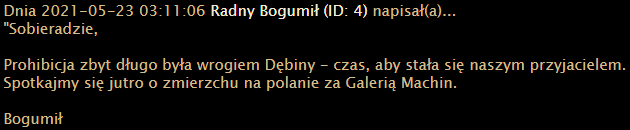
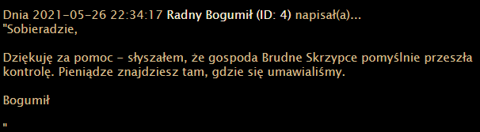
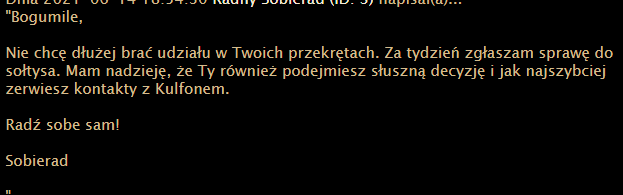

# Różdżka chaosu, Prohibicja, web

## Opis
"W Dębinie od wielu lat obowiązuje prohibicja. Krążą jednak plotki, że niektóre lokale nie stosują się do obowiązujących zakazów - a co gorsza, że pomagają im w tym radni. Gdyby tylko udało się dostać do ich prywatnych wiadomości...

Aby zgłosić sprawę do sołtysa, potrzebne są następujące informacje: nazwa lokalu, pseudonim właściciela Podaj je jako flagę."

## Rozwiązanie

Z treści zadania wynika, że trzeba wykorzystać podatność w skrzynce pocztowej na stronie.
Interesujący fragment kodu źródłowego skrzynki znajduje się w pliku [mail.php](./mail.php).
Po krótkiej analizie widzimy, że możemy czytać dowolne maile za pośrednictwem tego kawałka kodu:
```php
{
    $intPage = 0;
    $intPages = 0;
    $objMails = $db->Execute("SELECT * FROM `mail` WHERE `id`=".$_GET['read']);
    $_GET['one'] = 1;
}
```

Aby móc odczytać maila musimy podać jego id w parametrze `read` oraz ustawić parametr `one`. Po wykonaniu trzech zapytań otrzymujemy następujace maile:







Czyli flaga to: Brudne Skrzypce, Kulfon
