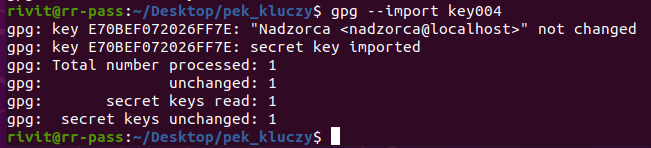
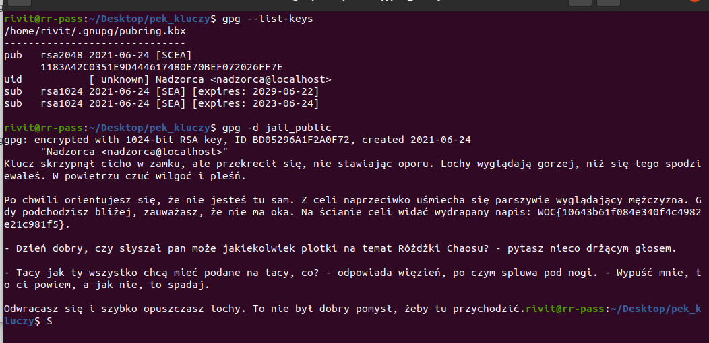

# Różdżka chaosu, Pęk kluczy, crypto

## Opis
"Udało Ci się odnaleźć pęk kluczy. Ciekawe, czy którymś z nich można otworzyć lochy?"

## Rozwiązanie

Otrzymujemy plik, który zawiera w sobie 9 plików .png (zdjęcia kluczy) oraz 9 plików, które są kluczami w sensie kryptograficznym. Udajemy się do Lochów, tam otrzymujemy ciąg znaków [data](./from_page.txt), który na pierwszy rzut oka wygląda jak klucz. Do wstępnego rozeznania wykorzystałem polecenie `file`, które zidentyfikowało kilka plików:

Po krótkim researchu doszedłem do wniosku, że jest to klucz publiczny PGP, ale bez nagłówków. Po dodaniu nagłówków [jail_public](./jail_public) użyłem narzędzia `pgpdump`, które pozwoliło uzyskać kilka cennych informacji o kluczu.

Okazuje się, że klucz ten zawiera także zakodowane dane. Teraz wystarczy tylko dopasować odpowiedni klucz prywatny i zdekodować dane. Kandydatami są pliki `key003` oraz `key004` z racji, że są to klucze PGP. Za pomocą narzędzia `gpg` podjąłem próbę importu obu kluczy. Tylko jeden z nich został zaimportowany poprawnie (key003).

Teraz wystarczy tylko zdekodować wiadomość i odczytać flagę:

