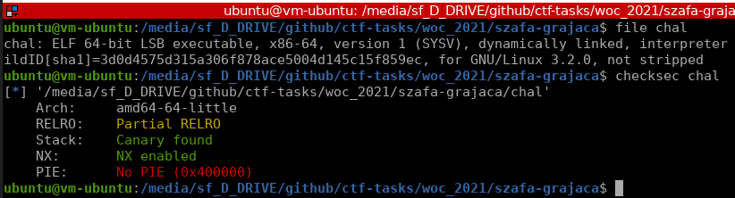

# Różdżka chaosu, Szafa grająca, binary

## Opis
"Kto wie, co kryje w sobie szafa grająca... Podaj napis wygrawerowany na monecie."

## Rozwiązanie

Na początku mały recon:



dekompilujemy binarkę za pomocą IDA [chal.c](./chal.c) i widzimy, że musimy wywołać funkcję `admin()`. Po krótkiej analizie widzimy, że błąd jest w funkcji `choice`:
```c
printf("Nadpisywanie adresu: ");
__isoc99_scanf("%p", &(&s)[v1]);
```

możemy nadpisać sobie jakąś jedną wartość w programie. W tym przypadku będzie to return address.

Łączymy się z serwerem, wybieramy opcję `4` (menu debugowe), potem wpisujemy liczbę `11` (offset obliczony za pomocą debuggera) i podajemy adres docelowej funkcji `0x4011b0`. Na koniec wychodzimy z menu opcją `3` i cieszymy się zdobytą flagą.

Skrypt rozwiązujący: [solve.py](./solve.py)
